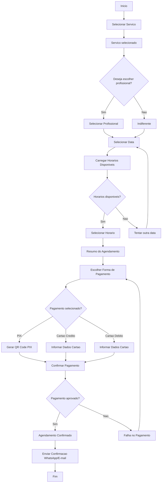
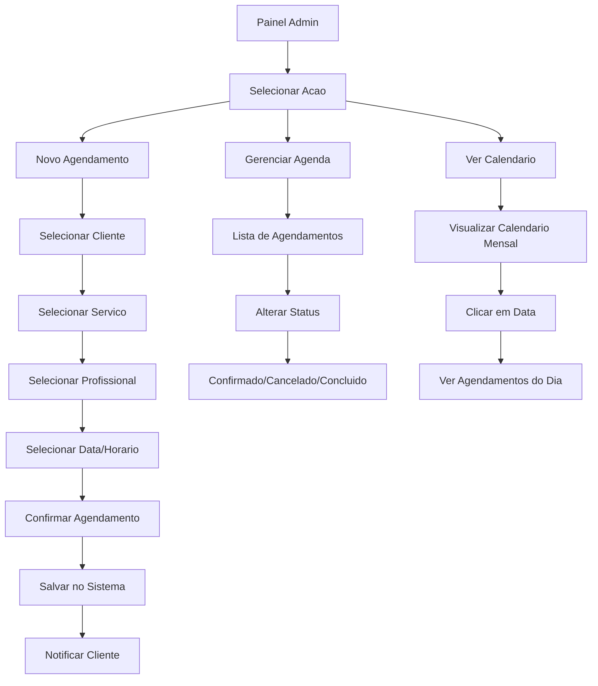
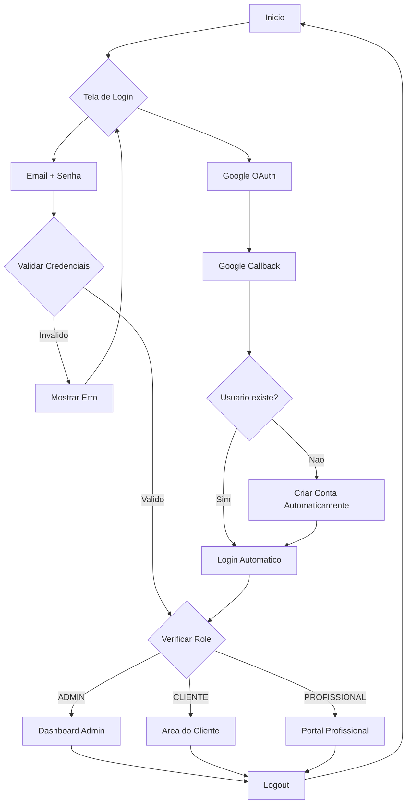
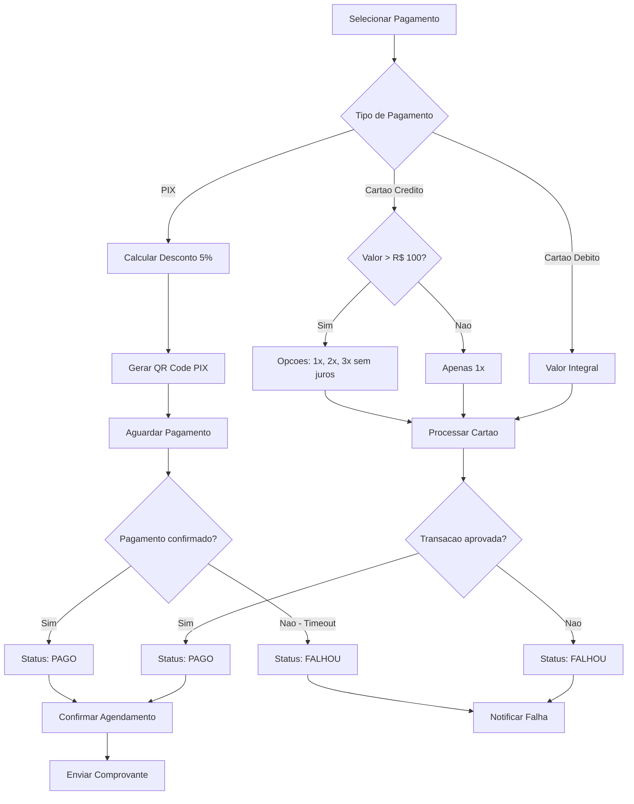
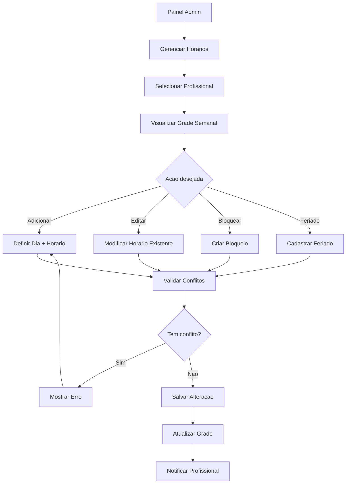

# ESPECIFICACAO TECNICA COMPLETA

## Clinica de Estetica e Fisioterapia — PWA

**Versao:** 1.0  
**Data:** 05 de Agosto de 2026  
**Status:** Documento de Especificacao Tecnica

---

# SUMARIO

- [00. Sumario Executivo](#00-sumario-executivo)
- [01. Identidade Visual e Wireframes](#01-identidade-visual-e-wireframes)
- [02. Arquitetura do Sistema](#02-arquitetura-do-sistema)
- [03. Banco de Dados](#03-banco-de-dados)
- [04. Fluxogramas de Processos](#04-fluxogramas-de-processos)
- [05. Regras de Negocio](#05-regras-de-negocio)
- [06. Perfis e Permissoes](#06-perfis-e-permissoes)
- [07. APIs REST](#07-apis-rest)
- [08. Prisma Schema](#08-prisma-schema)
- [09. Stack Tecnologica](#09-stack-tecnologica)
- [10. Estrutura de Pastas](#10-estrutura-de-pastas)
- [11. Seguranca](#11-seguranca)
- [12. Docker e Deploy](#12-docker-e-deploy)
- [13. Checklist de Desenvolvimento](#13-checklist-de-desenvolvimento)
- [14. Plano de Testes](#14-plano-de-testes)
- [15. Prompt Mestre para IA](#15-prompt-mestre-para-ia)

---

# 00. SUMARIO EXECUTIVO

## Nome do Projeto
**Clinica de Estetica e Fisioterapia — PWA**

## Marca
**Beleza & Bem-Estar** — Estetica e Fisioterapia

## Objetivo
Desenvolver um Progressive Web App (PWA) completo para clinicas de estetica e fisioterapia, permitindo agendamento online, pagamentos e gestao administrativa. Interface premium inspirada nos mockups aprovados, com paleta em tons creme e dourado.

## Publico-Alvo
- **Clientes:** Pessoas que buscam servicos de estetica e fisioterapia
- **Administradores:** Gestores de clinicas que precisam gerenciar agendamentos, profissionais e servicos

## Diferenciais
- PWA instalavel — experiencia nativa sem app store
- Agendamento simplificado — fluxo em 3 passos
- PIX com desconto — 5% automatico
- Interface premium — design creme e dourado
- Dashboard completo — KPIs e gestao total
- Notificacoes — lembretes via WhatsApp e e-mail

## Escopo (Fases 1 e 2)

### Fase 1 — MVP
- Landing Page completa
- Fluxo de agendamento (3 passos)
- Area do cliente (historico, perfil)
- Painel administrativo completo
- Integracao pagamento (PIX + Cartao)
- PWA instalavel
- Autenticacao (Admin + Cliente)

### Fase 2 — Expansao
- Programa de fidelidade
- Cupons de desconto
- Relatorios financeiros
- Notificacoes push
- Vale-presente

## Stack Tecnologica

| Camada | Tecnologia |
|--------|------------|
| Frontend | Next.js 15+ (App Router) |
| UI | shadcn/ui + Tailwind CSS |
| Backend | Server Actions + Route Handlers |
| Banco | PostgreSQL + Prisma ORM |
| Auth | Auth.js (NextAuth) |
| Pagamento | Mercado Pago ou Asaas |
| Deploy | Docker + Nginx |
| CDN/SSL | Cloudflare |

## Referencias Visuais
- Mockup Landing Page: `imgs/landing page.png`
- Mockup Agendamento: `imgs/agendamento.png`
- Mockup Painel Admin: `imgs/painel adm.png`

---

# 01. IDENTIDADE VISUAL E WIREFRAMES

## 1.1 Paleta de Cores

### Cores Principais

| Cor | Hex | RGB | Uso |
|-----|-----|-----|-----|
| **Creme** | `#F5F0E8` | 245, 240, 232 | Fundo principal |
| **Branco** | `#FFFFFF` | 255, 255, 255 | Cards, fundo secundario |
| **Dourado** | `#C9A96E` | 201, 169, 110 | Acentos, CTA, botoes |
| **Dourado Escuro** | `#A8893E` | 168, 137, 62 | Hover, secundario |
| **Marrom** | `#8B6914` | 139, 105, 20 | Titulos |
| **Marrom Escuro** | `#5C4A3A` | 92, 74, 58 | Texto principal |
| **Marrom Sidebar** | `#2C2C2C` | 44, 44, 44 | Sidebar admin |

### Cores de Status

| Cor | Hex | Uso |
|-----|-----|-----|
| **Sucesso** | `#4CAF50` | Confirmado, Pago |
| **Alerta** | `#FF9800` | Pendente |
| **Erro** | `#E53935` | Cancelado, Falhou |
| **Info** | `#2196F3` | Informacoes |

## 1.2 Tipografia

| Uso | Fonte | Peso |
|-----|-------|------|
| Titulos | Playfair Display | 400, 600, 700 |
| Corpo | Inter | 400, 500, 600 |

| Elemento | Tamanho | Peso |
|----------|---------|------|
| H1 | 48px / 3rem | 700 |
| H2 | 36px / 2.25rem | 600 |
| H3 | 24px / 1.5rem | 600 |
| H4 | 20px / 1.25rem | 600 |
| Corpo | 16px / 1rem | 400 |
| Pequeno | 14px / 0.875rem | 400 |
| Mini | 12px / 0.75rem | 400 |

## 1.3 Espacamento

| Token | Valor |
|-------|-------|
| space-1 | 4px |
| space-2 | 8px |
| space-3 | 12px |
| space-4 | 16px |
| space-5 | 20px |
| space-6 | 24px |
| space-8 | 32px |
| space-10 | 40px |
| space-12 | 48px |
| space-16 | 64px |

## 1.4 Bordas e Raios

| Elemento | Raio |
|----------|------|
| Cards | 12px |
| Botoes | 8px |
| Inputs | 8px |
| Badges | 16px (pill) |
| Avatares | 50% (circulo) |

## 1.5 Sombras

| Nivel | Valor |
|-------|-------|
| Sombra Leve | `0 1px 3px rgba(0,0,0,0.1)` |
| Sombra Media | `0 4px 6px rgba(0,0,0,0.1)` |
| Sombra Forte | `0 10px 15px rgba(0,0,0,0.1)` |

## 1.6 Wireframes

### WIREFRAME 01: Landing Page — Desktop

```
+-----------------------------------------------------------------------------+
| [Logo]  Inicio | Sobre Nos | Servicos | Pacotes | Depoimentos | Contato   |
|                                                    [ AGENDAR AGORA]        |
+-----------------------------------------------------------------------------+
|                                                                             |
|   CUIDADO QUE                                                             |
|   TRANSFORMA                                                              |
|                                                                             |
|   Estetica e Fisioterapia para realcar                                   |
|   sua beleza e bem-estar.                                                 |
|                                                                             |
|   [ Atendim.] [ Profiss.] [ Ambiente] [ Tecnol.]                        |
|   [Personaliz.] [Qualificad] [Acolhedor] [Modernas]                      |
|                                                                             |
|   [ AGENDAR SEU HORARIO]            +----------------------+              |
|                                      |    OFERTA ESPECIAL    |              |
|                                      |                       |              |
|                                      |  DE: R$ 300,00       |              |
|                                      |  POR: R$ 150,00      |              |
|                                      |                       |              |
|                                      |  1m presente de       |              |
|                                      |  autocuidado          |              |
|                                      +----------------------+              |
+-----------------------------------------------------------------------------+
|                                                                             |
|                      — NOSSOS SERVICOS —                                   |
|                                                                             |
|  +--------------+ +--------------+ +--------------+ +--------------+       |
|  |   [Icone]    | |   [Icone]    | |   [Icone]    | |   [Icone]    |       |
|  |              | |              | |              | |              |       |
|  |  LIMPEZA DE  | |  MASSAGEM    | |  VENTOSA-    | |  FISIO-      |       |
|  |    PELE      | |  RELAXANTE   | |  TERAPIA     | |  TERAPIA     |       |
|  |              | |              | |              | |              |       |
|  | Remove       | | Alivia       | | Terapia que  | | Tratamentos  |       |
|  | impurezas... | | tensões...   | | auxilia na   | | personaliz.  |       |
|  |              | |              | | circulacao.. | |              |       |
|  | [SAIBA MAIS] | | [SAIBA MAIS] | | [SAIBA MAIS] | | [SAIBA MAIS] |       |
|  +--------------+ +--------------+ +--------------+ +--------------+       |
|                                                                             |
|  +---------------------------------------------------+                    |
|  |  AGENDAR HORARIO                                  |                    |
|  |                                                    |                    |
|  |  Selecione o servico                              |                    |
|  |  +--------------------------------------------+   |                    |
|  |  | Selecione um servico                  [v] |   |                    |
|  |  +--------------------------------------------+   |                    |
|  |                                                    |                    |
|  |  Profissional (opcional)                          |                    |
|  |  +--------------------------------------------+   |                    |
|  |  | Qual profissional?                    [v] |   |                    |
|  |  +--------------------------------------------+   |                    |
|  |                                                    |                    |
|  |  Data                                             |                    |
|  |  +--------------------------------------------+   |                    |
|  |  | Escolha a data                        [cal]|   |                    |
|  |  +--------------------------------------------+   |                    |
|  |                                                    |                    |
|  |  Horario                                          |                    |
|  |  +--------------------------------------------+   |                    |
|  |  | Escolha o horario                    [v]  |   |                    |
|  |  +--------------------------------------------+   |                    |
|  |                                                    |                    |
|  |  [ VER DISPONIBILIDADE]                           |                    |
|  |                                                    |                    |
|  |  Seus dados estao protegidos                      |                    |
|  +---------------------------------------------------+                    |
+-----------------------------------------------------------------------------+
|  [ Relax]    [ Harmonize]    [ Autoestima]    [ Resultados]               |
|  Relaxe e      Corpo e Mente    Confianca          Comprovados            |
|  Desconte                                                                    |
+-----------------------------------------------------------------------------+
|                                                                             |
|  PRESENTEIE QUEM VOCE AMA!                                                |
|  Vale-presente disponivel. Surpreenda com cuidado e bem-estar.            |
|                                            [ADQUIRIR VALE-PRESENTE]        |
+-----------------------------------------------------------------------------+
|                                                                             |
|                    — O QUE NOSSOS CLIENTES DIZEM —                        |
|                                                                             |
|  +------------------+ +------------------+ +------------------+            |
|  |                  | |                  | |                  |            |
|  | "Ambiente marav. | | "A ventosaterapia| | "As massagens sao |            |
|  | profissionais... | | me ajudou muito..."| | simplesmente..."  |            |
|  |                  | |                  | |                  |            |
|  | [Foto] Juliana S.| | [Foto] Carlos M.| | [Foto] Fernanda A|            |
|  +------------------+ +------------------+ +------------------+            |
+-----------------------------------------------------------------------------+
|  CONTATO            HORARIO             NOVIDADES                         |
|  (21) 99999-9999    Seg-Sex: 8h as 20h  Seu melhor e-mail                |
|  (21) 99999-9999    Sab: 8h as 16h      [____________] [ENVIAR]          |
|  @belezaebemestar   Dom: Fechado                                         |
|  Rua das Flores, 123 [VER NO MAPA]                                       |
+-----------------------------------------------------------------------------+
|  2025 Beleza & Bem-Estar. Politica de Privacidade | Termos de Uso         |
+-----------------------------------------------------------------------------+
```

### WIREFRAME 02: Landing Page — Mobile

```
+---------------------+
| [menu]  [Logo]  [ag]| 
+---------------------+
|                     |
|  CUIDADO QUE       |
|  TRANSFORMA        |
|                     |
|  Estetica e        |
|  Fisioterapia para |
|  realcar sua       |
|  beleza.           |
|                     |
| [ AGENDAR]         |
|                     |
| +-----------------+|
| |  OFERTA         ||
| |  R$ 300 > R$150 ||
| +-----------------+|
+---------------------+
|                     |
|  NOSSOS SERVICOS   |
|                     |
| +-----------------+|
| | [Icone]         ||
| | LIMPEZA DE PELE ||
| | Remove impurez..||
| | [SAIBA MAIS]    ||
| +-----------------+|
| +-----------------+|
| | [Icone]         ||
| | MASSAGEM        ||
| | RELAXANTE       ||
| | [SAIBA MAIS]    ||
| +-----------------+|
+---------------------+
|  AGENDAR HORARIO   |
|                     |
|  Servico    [v]    |
|  Profissional [v]  |
|  Data       [cal]  |
|  Horario    [v]    |
|                     |
|  [VER DISPONIB.]   |
+---------------------+
|                     |
|  DEPOIMENTOS       |
|                     |
|                    |
|  "Ambiente marav." |
|  [Foto] Juliana S. |
|                     |
+---------------------+
|  (21) 99999-9999   |
|  Seg-Sex 8h-20h    |
|  Newsletter        |
|  [______] [ENVIAR] |
+---------------------+
```

### WIREFRAME 03: Fluxo de Agendamento — Passo 1 (Servico)

```
+-----------------------------------------------------------------------------+
| [Logo]  Inicio | Servicos | Meus Agendamentos        [Ola, Juliana v]     |
+-----------------------------------------------------------------------------+
|                                                                             |
|  Agendamento  >  Escolha seu servico                                      |
|                                                                             |
|  +------+         +------+         +------+                               |
|  |  1   |=========|  2   |---------|  3   |                               |
|  |SERVICO|         |DATA E|         |CONFIR|                               |
|  |      |         |HORARIO|         |MACAO |                               |
|  +------+         +------+         +------+                               |
|                                                                             |
+--------------------------------------+--------------------------------------+
|                                      |                                      |
|  1. ESCOLHA SEU SERVICO             |  RESUMO DO AGENDAMENTO              |
|                                      |                                      |
|  +----------------+ +----------------+   +--------------------+            |
|  | [Imagem]       | | [Imagem]       |   |   [Imagem]         |            |
|  |                | |                |   |                    |            |
|  | [x] LIMPEZA DE | | MASSAGEM       |   |  Servico           |            |
|  |    PELE        | | RELAXANTE      |   |  Limpeza de Pele   |            |
|  |                | |                |   |  60 minutos        |            |
|  | Remove impurez.| | Alivio de      |   |                    |            |
|  | e celulas      | | tensões e      |   |  Profissional      |            |
|  | mortas.        | | relaxamento.   |   |  Juliana A.        |            |
|  |                | |                |   |                    |            |
|  | 60 min         | | 60 min         |   |  Preco             |            |
|  | R$ 150,00      | | R$ 150,00      |   |  R$ 150,00         |            |
|  +----------------+ +----------------+   |                    |            |
|                                          |  Pague via PIX     |            |
|  +----------------+ +----------------+   | e ganhe 5% de      |            |
|  | [Imagem]       | | [Imagem]       |   | desconto!          |            |
|  |                | |                |   |                    |            |
|  | VENTOSA-       | | FISIO-         |   | Subtotal  R$150,00 |            |
|  | TERAPIA        | | TERAPIA        |   | Desconto   -R$7,50 |            |
|  |                | |                |   | Total     R$142,50 |            |
|  | Auxilia na     | | Reabilitacao   |   |                    |            |
|  | circulacao e   | | e alivio de    |   | Seus dados         |            |
|  | eliminacao de  | | dores.         |   | estao protegidos   |            |
|  | toxinas.       | |                |   +--------------------+            |
|  |                | |                |                                      |
|  | 45 min         | | 50 min         |                                      |
|  | R$ 150,00      | | R$ 150,00      |                                      |
|  +----------------+ +----------------+                                      |
|                                                                              |
|  +----------------+                                                         |
|  | OUTROS         |                                                         |
|  | SERVICOS       |                                                         |
|  |                |                                                         |
|  | Consulte outros|                                                         |
|  | tratamentos... |                                                         |
|  |                |                                                         |
|  | [VER TODOS]    |                                                         |
|  +----------------+                                                         |
|                                                                              |
+--------------------------------------+--------------------------------------+
|  AGENDAMENTO RAPIDO    PAGAMENTO SEGURO    LEMBRETE AUTOMATICO             |
|  Em poucos cliques      Seus dados protegidos Avisamos via WhatsApp        |
+-----------------------------------------------------------------------------+
```

### WIREFRAME 04: Fluxo de Agendamento — Passo 2 (Profissional + Data/Horario)

```
+-----------------------------------------------------------------------------+
| [Logo]  Inicio | Servicos | Meus Agendamentos        [Ola, Juliana v]     |
+-----------------------------------------------------------------------------+
|                                                                             |
|  Agendamento  >  Escolha seu servico                                      |
|                                                                             |
|  +------+         +------+         +------+                               |
|  |  1   |=========|  2   |=========|  3   |                               |
|  |SERVICO|         |DATA E|         |CONFIR|                               |
|  |  ok   |         |HORARIO|         |MACAO |                               |
|  +------+         +------+         +------+                               |
|                                                                             |
+--------------------------------------+--------------------------------------+
|                                      |                                      |
|  2. ESCOLHA A PROFISSIONAL (OPC.)   |  RESUMO DO AGENDAMENTO              |
|                                      |                                      |
|  +----------+ +----------+ +------+  |  Servico: Limpeza de Pele          |
|  | [Foto]   | | [Foto]   | | [user]|  |  Profissional: Juliana A.         |
|  |          | |          | |       |  |                                    |
|  | Juliana  | | Carla S. | |Indif. |  |  Preco: R$ 150,00                 |
|  | A.       | |          | |       |  |                                    |
|  | Estetici | | Fisioter | | Qualq. |  |  PIX: R$ 142,50                   |
|  | sta      | | apeuta   | | prof. |  |                                    |
|  | *** (32) | | *****(28)| | dispo.|  |  Subtotal:    R$ 150,00          |
|  +----------+ +----------+ +------+  |  Desconto PIX: - R$ 7,50         |
|                                      |  Total:       R$ 142,50           |
|                                      |                                    |
|  3. ESCOLHA A DATA E O HORARIO      |  Seus dados protegidos            |
|                                      +------------------------------------+
|  +---------------------------+                                              |
|  |  <  AGOSTO 2025  >        |                                              |
|  |                           |                                              |
|  |  DOM SEG TER QUA QUI SEX SAC                                         |
|  |                  1    2                                                 |
|  |   3    4    5   [6]   7    8                                           |
|  |   9   10   11   12   13   14   15                                      |
|  |  16   17   18   19   20   21   22                                      |
|  |  23   24   25   26   27   28   29                                      |
|  |  30   31                                                               |
|  +---------------------------+                                              |
|                                                                             |
|  HORARIOS DISPONIVEIS — 06/08/2025                                        |
|                                                                             |
|  +-----+ +-----+ +-----+ +-----+ +-----+ +-----+                        |
|  |08:00| |09:00| |10:00| |11:00| |12:00| |13:00|                        |
|  +-----+ +-----+ +-----+ +-----+ +-----+ +-----+                        |
|  +-----+ +-----+ +-----+ +-----+ +-----+ +-----+                        |
|  |14:00| |15:00| |16:00| |17:00| |18:00| |19:00|                        |
|  | [x] | +-----+ +-----+ +-----+ +-----+ +-----+                        |
|  +-----+                                                                   |
|                                                                             |
|  Horarios com disponibilidade em destaque.                                 |
|                                                                             |
|  +------------------------------------------------------+                 |
|  |  INFORMACOES IMPORTANTES                              |                 |
|  |  Chegue com 10 minutos de antecedencia                |                 |
|  |  Em caso de imprevistos, avise com antecedencia       |                 |
|  |  Cancelamentos com menos de 24h podem ter taxa        |                 |
|  |                                                        |                 |
|  |  PRECISA DE AJUDA?                                     |                 |
|  |  Fale conosco pelo WhatsApp                            |                 |
|  |  (21) 99999-9999                                      |                 |
|  +------------------------------------------------------+                 |
|                                                                             |
+-----------------------------------------------------------------------------+
```

### WIREFRAME 05: Fluxo de Agendamento — Passo 3 (Confirmacao + Pagamento)

```
+-----------------------------------------------------------------------------+
| [Logo]  Inicio | Servicos | Meus Agendamentos        [Ola, Juliana v]     |
+-----------------------------------------------------------------------------+
|                                                                             |
|  Agendamento  >  Confirmacao e Pagamento                                  |
|                                                                             |
|  +------+         +------+         +------+                               |
|  |  1   |=========|  2   |=========|  3   |                               |
|  |SERVICO|  ok     |DATA E|  ok     |CONFIR|                               |
|  |  ok   |         |HORARIO|         |MACAO |                               |
|  +------+         +------+         +------+                               |
|                                                                             |
+--------------------------------------+--------------------------------------+
|                                      |                                      |
|  CONFIRME SEUS DADOS                |  RESUMO DO PEDIDO                   |
|                                      |                                      |
|  Servico                             |  Limpeza de Pele (60 min)          |
|     Limpeza de Pele                  |  Profissional: Juliana A.          |
|                                      |                                    |
|  Profissional                        |  Subtotal:      R$ 150,00         |
|     Juliana A.                       |  Desconto PIX (5%): - R$ 7,50     |
|                                      |  Total com desconto:               |
|  Data                                |  R$ 142,50                         |
|     06/08/2025 (Quarta-feira)       |                                    |
|                                      |                                    |
|  Horario                             |                                    |
|     14:00                            |                                    |
|                                      |                                    |
|  Duracao                             |                                    |
|     60 minutos                       |                                    |
|                                      |                                    |
|  [<- VOLTAR E EDITAR]               |                                    |
|                                      |                                    |
|                                      |                                    |
|  ESCOLHA A FORMA DE PAGAMENTO       |                                    |
|                                      |                                    |
|  +------------------------------------+                                  |
|  | PIX — 5% de desconto               |                                  |
|  |    Pagamento instantaneo            |                                  |
|  |    R$ 142,50     Economize R$ 7,50  |                                  |
|  +------------------------------------+                                  |
|                                      |                                    |
|  +------------------------------------+                                  |
|  | Cartao de Credito                  |                                  |
|  |    Pague em ate 3x sem juros       |                                  |
|  |    R$ 150,00                       |                                  |
|  +------------------------------------+                                  |
|                                      |                                    |
|  +------------------------------------+                                  |
|  | Cartao de Debito                   |                                  |
|  |    Pagamento a vista               |                                  |
|  |    R$ 150,00                       |                                  |
|  +------------------------------------+                                  |
|                                      |                                    |
|  Ambiente 100% seguro. Seus dados e  |                                    |
|  pagamento estao protegidos.         |                                    |
|                                      |                                    |
|  [ CONFIRMAR AGENDAMENTO]           |                                    |
|                                      |                                    |
|  Ao confirmar, voce concorda com     |                                    |
|  Termos de Uso e Politica de        |                                    |
|  Cancelamento.                       |                                    |
|                                      |                                    |
+--------------------------------------+--------------------------------------+
|  AGENDAMENTO RAPIDO    PAGAMENTO SEGURO    LEMBRETE AUTOMATICO             |
+-----------------------------------------------------------------------------+
```

### WIREFRAME 06: Login

```
+-----------------------------------------------------------------------------+
|                                                                             |
|                              [Logo Grande]                                  |
|                       Beleza & Bem-Estar                                   |
|                    Estetica e Fisioterapia                                 |
|                                                                             |
|  +-------------------------------------------------------------------+    |
|  |                                                                    |    |
|  |                        ENTRAR                                     |    |
|  |                                                                    |    |
|  |  E-mail                                                           |    |
|  |  +------------------------------------------------------------+   |    |
|  |  | seu@email.com                                              |   |    |
|  |  +------------------------------------------------------------+   |    |
|  |                                                                    |    |
|  |  Senha                                                            |    |
|  |  +------------------------------------------------------------+   |    |
|  |  | ........                                       [olho]     |   |    |
|  |  +------------------------------------------------------------+   |    |
|  |                                                                    |    |
|  |  [ ENTRAR]                                                       |    |
|  |                                                                    |    |
|  |  --------------- ou ---------------                              |    |
|  |                                                                    |    |
|  |  [G] Entrar com Google                                            |    |
|  |                                                                    |    |
|  |  Esqueceu a senha? Clique aqui                                    |    |
|  |                                                                    |    |
|  |  Nao tem conta? Cadastre-se                                       |    |
|  |                                                                    |    |
|  +-------------------------------------------------------------------+    |
|                                                                             |
+-----------------------------------------------------------------------------+
```

### WIREFRAME 07: Cadastro de Cliente

```
+-----------------------------------------------------------------------------+
|                                                                             |
|                              [Logo Grande]                                  |
|                       Beleza & Bem-Estar                                   |
|                                                                             |
|  +-------------------------------------------------------------------+    |
|  |                                                                    |    |
|  |                      CRIAR CONTA                                  |    |
|  |                                                                    |    |
|  |  Nome completo                                                    |    |
|  |  +------------------------------------------------------------+   |    |
|  |  | Maria Silva                                                |   |    |
|  |  +------------------------------------------------------------+   |    |
|  |                                                                    |    |
|  |  E-mail                                                           |    |
|  |  +------------------------------------------------------------+   |    |
|  |  | maria@email.com                                            |   |    |
|  |  +------------------------------------------------------------+   |    |
|  |                                                                    |    |
|  |  Telefone                                                          |    |
|  |  +------------------------------------------------------------+   |    |
|  |  | (21) 99999-9999                                            |   |    |
|  |  +------------------------------------------------------------+   |    |
|  |                                                                    |    |
|  |  CPF (opcional)                                                   |    |
|  |  +------------------------------------------------------------+   |    |
|  |  | 000.000.000-00                                             |   |    |
|  |  +------------------------------------------------------------+   |    |
|  |                                                                    |    |
|  |  Senha                                                            |    |
|  |  +------------------------------------------------------------+   |    |
|  |  | ........                                         [olho]     |   |    |
|  |  +------------------------------------------------------------+   |    |
|  |  Minimo 8 caracteres, 1 maiuscula, 1 numero                      |    |
|  |                                                                    |    |
|  |  Confirmar senha                                                  |    |
|  |  +------------------------------------------------------------+   |    |
|  |  | ........                                                   |   |    |
|  |  +------------------------------------------------------------+   |    |
|  |                                                                    |    |
|  |  [x] Li e aceito os Termos de Uso e Politica de Privacidade      |    |
|  |                                                                    |    |
|  |  [ CRIAR CONTA]                                                  |    |
|  |                                                                    |    |
|  |  Ja tem conta? Entrar                                             |    |
|  |                                                                    |    |
|  +-------------------------------------------------------------------+    |
|                                                                             |
+-----------------------------------------------------------------------------+
```

### WIREFRAME 08: Area do Cliente — Meus Agendamentos

```
+-----------------------------------------------------------------------------+
| [Logo]  Inicio | Agendar | Meus Agendamentos | Perfil   [Ola, Juliana v]  |
+-----------------------------------------------------------------------------+
|                                                                             |
|  Meus Agendamentos                                                         |
|                                                                             |
|  +-------------+ +-------------+ +-------------+ +-------------+          |
|  |  Proximos   | |  Historico  | |  Cancelados | |  Avaliados  |          |
|  |    (2)      | |    (5)      | |    (1)      | |    (3)      |          |
|  +-------------+ +-------------+ +-------------+ +-------------+          |
|                                                                             |
|  PROXIMOS AGENDAMENTOS                                                    |
|                                                                             |
|  +-------------------------------------------------------------------+    |
|  |  06/08/2025 — Quarta-feira                                       |    |
|  |                                                                    |    |
|  |  14:00 — Limpeza de Pele (60 min)                                |    |
|  |  Profissional: Juliana A.                                         |    |
|  |  PIX — R$ 142,50                                                 |    |
|  |                                                                    |    |
|  |  [Cancelar]  [Reagendar]                                          |    |
|  +-------------------------------------------------------------------+    |
|                                                                             |
|  +-------------------------------------------------------------------+    |
|  |  12/08/2025 — Terca-feira                                        |    |
|  |                                                                    |    |
|  |  10:00 — Massagem Relaxante (60 min)                             |    |
|  |  Profissional: Carla S.                                           |    |
|  |  Cartao de Credito — R$ 150,00                                   |    |
|  |                                                                    |    |
|  |  [Cancelar]  [Reagendar]                                          |    |
|  +-------------------------------------------------------------------+    |
|                                                                             |
|  HISTORICO                                                                |
|                                                                             |
|  +-------------------------------------------------------------------+    |
|  |  25/07/2025 — Venha de Pele — Concluido ok                       |    |
|  |  Juliana A.  PIX — R$ 142,50                                     |    |
|  |  [Avaliar]  [Agendar Novamente]                                  |    |
|  +-------------------------------------------------------------------+    |
|                                                                             |
+-----------------------------------------------------------------------------+
|  2025 Beleza & Bem-Estar                                                  |
+-----------------------------------------------------------------------------+
```

### WIREFRAME 09: Area do Cliente — Perfil

```
+-----------------------------------------------------------------------------+
| [Logo]  Inicio | Agendar | Meus Agendamentos | Perfil   [Ola, Juliana v]  |
+-----------------------------------------------------------------------------+
|                                                                             |
|  Meu Perfil                                                                |
|                                                                             |
|  +-------------------------------------------------------------------+    |
|  |                                                                    |    |
|  |                        [Foto]                                      |    |
|  |                     Juliana Alves                                 |    |
|  |              juliana@email.com                                    |    |
|  |                                                                    |    |
|  |  [Alterar Foto]                                                   |    |
|  |                                                                    |    |
|  +-------------------------------------------------------------------+    |
|                                                                             |
|  DADOS PESSOAIS                                                           |
|                                                                             |
|  Nome completo                                                             |
|  +------------------------------------------------------------+           |
|  | Juliana Alves                                               |           |
|  +------------------------------------------------------------+           |
|                                                                             |
|  E-mail                                                                    |
|  +------------------------------------------------------------+           |
|  | juliana@email.com                                          |           |
|  +------------------------------------------------------------+           |
|                                                                             |
|  Telefone                                                                  |
|  +------------------------------------------------------------+           |
|  | (21) 99999-9999                                            |           |
|  +------------------------------------------------------------+           |
|                                                                             |
|  CPF                                                                       |
|  +------------------------------------------------------------+           |
|  | 000.000.000-00                                             |           |
|  +------------------------------------------------------------+           |
|                                                                             |
|  Data de nascimento                                                        |
|  +------------------------------------------------------------+           |
|  | 15/03/1990                                                 |           |
|  +------------------------------------------------------------+           |
|                                                                             |
|  [SALVAR ALTERACOES]                                                       |
|                                                                             |
|  ------------------------------------------------------------------------- |
|                                                                             |
|  ALTERAR SENHA                                                             |
|                                                                             |
|  Senha atual                                                               |
|  +------------------------------------------------------------+           |
|  | ........                                                   |           |
|  +------------------------------------------------------------+           |
|                                                                             |
|  Nova senha                                                                |
|  +------------------------------------------------------------+           |
|  | ........                                                   |           |
|  +------------------------------------------------------------+           |
|                                                                             |
|  Confirmar nova senha                                                      |
|  +------------------------------------------------------------+           |
|  | ........                                                   |           |
|  +------------------------------------------------------------+           |
|                                                                             |
|  [ATUALIZAR SENHA]                                                         |
|                                                                             |
+-----------------------------------------------------------------------------+
|  2025 Beleza & Bem-Estar                                                  |
+-----------------------------------------------------------------------------+
```

### WIREFRAME 10: Painel Admin — Dashboard

```
+-----------------------------------------------------------------------------+
| =  Dashboard                                    (3)  [Admin v]            |
+----------+-----------------------------------------------------------------+
|          |                                                                  |
| Home     |  +----------+ +----------+ +--------------+ +----------+        |
| Dash     |  | 48       | | 162      | | R$ 7.842     | | 56       |        |
|          |  | Agendam. | | Clientes | | Faturamento  | | Servicos |        |
| AGENDAM. |  | +12%     | | +8%      | | +18%         | | +10%     |        |
| ---------|  +----------+ +----------+ +--------------+ +----------+        |
| Agenda   |                                                                  |
| Calend   |  AGENDAMENTOS RECENTES                    [Ver todos >]        |
| Horario  |  +--------------------------------------------------------+    |
| Bloqueio |  | Todos | Confirmados | Pendentes | Cancelados           |    |
|          |  +------+------+----------+--------+----------+--------+    |
| CLIENTES |  | Data | Hora | Servico  |Cliente |Prof.     |Status  |    |
| ---------|  +------+------+----------+--------+----------+--------+    |
| Clientes |  |06/08 |14:00 |Limpeza   |Juliana |Juliana A.| ok     |    |
| Bloqueio |  |06/08 |15:30 |Massagem  |Carlos  |Carla S.  | ok     |    |
|          |  |06/08 |16:30 |Ventosat. |Fernanda|Juliana A.| ok     |    |
| SERVICOS |  |07/08 |09:00 |Fisio     |Marcos  |Carla S.  | wait   |    |
| ---------|  |07/08 |10:30 |Massagem  |Ana B.  |Carla S.  | ok     |    |
| Servicos |  +------+------+----------+--------+----------+--------+    |
| Catego   |                                                                  |
| Profis   |  +--------------------+ +--------------------+               |
|          |  | CALENDARIO GERAL   | | GERENCIAR HORARIOS |               |
| FINANCEIR|  |                    | | 06/08/2025         |               |
| ---------|  | < AGOSTO 2025 >    | | Profissional: [v] |               |
| Pagamento|  | DOM SEG TER QUA    | |                     |               |
| Relator. |  | 1   2   3  [4]   | | 08:00 09:00 10:00  |               |
| Taxas    |  | 5   6   7   8    | | 11:00 12:00 13:00  |               |
|          |  | 9  10  11  12    | | [14:00] 15:00 16:00 |               |
| CONTEUDO |  |                    | | 17:00 18:00 19:00  |               |
| ---------|  | Disponivel         | |                     |               |
| Depoim.  |  | Poucos horarios    | | + Adicionar/Bloquear|              |
| Cupons   |  | Bloqueado          | |                     |               |
| Notif.   |  +--------------------+ +--------------------+               |
|          |                                                                  |
| CONFIG   |  PROXIMOS AGENDAMENTOS  |  ACOES RAPIDAS                      |
| ---------|  +--------------------+ |  +------+ +------+ +------+        |
| Perfil   |  | 08:00 Limpeza     | |  | Novo | |Bloq. | |Cadastr|       |
| Gerais   |  | 09:30 Massagem    | |  |Agend. | |Horar. | |Serv. |        |
|          |  | 11:00 Fisio       | |  +------+ +------+ +------+        |
| Ajuda    |  | 14:00 Ventosat.   | |  +------+ +------+ +------+        |
|          |  +--------------------+ |  |Cadastr| |Adic. | |Enviar|       |
|          |                          |  |Prof.  | |Promo. | |Notif.|       |
|          |  ATIVIDADE RECENTE      |  +------+ +------+ +------+        |
|          |  Hoje, 10:24 Novo agend.|                                     |
|          |  Hoje, 09:58 Pagamento  |                                     |
|          |  Hoje, 09:30 Bloq.horar.|                                     |
+----------+-----------------------------------------------------------------+
```

### WIREFRAME 11: Admin — CRUD Servicos

```
+-----------------------------------------------------------------------------+
| =  Servicos                                       (3)  [Admin v]         |
+----------+-----------------------------------------------------------------+
|          |                                                                  |
| Home     |  Servicos                                      [+ Novo Servico] |
| Dash     |                                                                  |
|          |  +--------------------------------------------------------+    |
| AGENDAM. |  | Buscar servico...                                      |    |
| ---------|  +--------------------------------------------------------+    |
| Agenda   |                                                                  |
| Calend   |  +----------+----------+------+--------+------+--------+      |
| Horario  |  | SERVICO  |CATEGORIA |PRECO | DURACAO|STATUS| ACOES  |      |
| Bloqueio |  +----------+----------+------+--------+------+--------+      |
|          |  |Limpeza   |Facial    |R$150 | 60 min |  ok  |ed  ex  |      |
| CLIENTES |  |de Pele   |          |      |        |      |         |      |
| ---------|  +----------+----------+------+--------+------+--------+      |
| Clientes |  |Massagem  |Corporal  |R$150 | 60 min |  ok  |ed  ex  |      |
| Bloqueio |  |Relaxante |          |      |        |      |         |      |
|          |  +----------+----------+------+--------+------+--------+      |
| SERVICOS |  |Ventosa-  |Corporal  |R$150 | 45 min |  ok  |ed  ex  |      |
| ---------|  |terapia   |          |      |        |      |         |      |
| Servicos |  +----------+----------+------+--------+------+--------+      |
| Catego   |  |Fisio-    |Fisioter. |R$150 | 50 min |  ok  |ed  ex  |      |
| Profis   |  |terapia   |          |      |        |      |         |      |
|          |  +----------+----------+------+--------+------+--------+      |
| FINANCEIR|                                                                  |
| ---------|  [<- Anterior]          Pagina 1 de 2    [Proximo ->]          |
| Pagamento|                                                                  |
| Relator. |  FORMULARIO DE SERVICO                                         |
| Taxas    |  +--------------------------------------------------------+    |
|          |  | Nome do servico                                        |    |
| CONTEUDO |  | +----------------------------------------------------+ |    |
| ---------|  | | Limpeza de Pele                                    | |    |
| Depoim.  |  | +----------------------------------------------------+ |    |
| Cupons   |  | Descricao                                              |    |
| Notif.   |  | +----------------------------------------------------+ |    |
|          |  | | Remove impurezas e celulas mortas, promovendo...   | |    |
| CONFIG   |  | +----------------------------------------------------+ |    |
| ---------|  | Categoria    Duracao (min)    Preco (R$)               |    |
| Perfil   |  | [Facial v]   [60]             [150,00]                |    |
| Gerais   |  |                                                         |    |
|          |  | [SALVAR]  [CANCELAR]                                  |    |
| Ajuda    |  +--------------------------------------------------------+    |
+----------+-----------------------------------------------------------------+
```

### WIREFRAME 12: Admin — CRUD Profissionais

```
+-----------------------------------------------------------------------------+
| =  Profissionais                                   (3)  [Admin v]         |
+----------+-----------------------------------------------------------------+
|          |                                                                  |
| Home     |  Profissionais                            [+ Novo Profissional] |
| Dash     |                                                                  |
|          |  +--------------------------------------------------------+    |
| AGENDAM. |  | Buscar profissional...                                 |    |
| ---------|  +--------------------------------------------------------+    |
| Agenda   |                                                                  |
| Calend   |  +------------------------------------------------------+    |
| Horario  |  | [Foto]  Juliana A.                                    |    |
| Bloqueio |  |         Esteticista                                    |    |
|          |  |         ***** (32 avaliacoes)                         |    |
| CLIENTES |  |         Servicos: Limpeza de Pele, Ventosaterapia    |    |
| ---------|  |         Status: ok Ativo                              |    |
| Clientes |  |         [Editar] [Desativar] [Ver Agenda]            |    |
| Bloqueio |  +------------------------------------------------------+    |
|          |                                                                  |
| SERVICOS |  +------------------------------------------------------+    |
| ---------|  | [Foto]  Carla S.                                      |    |
| Servicos |  |         Fisioterapeuta                                |    |
| Catego   |  |         ***** (28 avaliacoes)                         |    |
| Profis   |  |         Servicos: Fisioterapia, Massagem              |    |
|          |  |         Status: ok Ativo                              |    |
| FINANCEIR|  |         [Editar] [Desativar] [Ver Agenda]            |    |
| ---------|  +------------------------------------------------------+    |
| Pagamento|                                                                  |
| Relator. |  FORMULARIO DE PROFISSIONAL                                    |
| Taxas    |  +--------------------------------------------------------+    |
|          |  | Nome completo                                         |    |
| CONTEUDO |  | +----------------------------------------------------+ |    |
| ---------|  | | Juliana Andrade                                    | |    |
| Depoim.  |  | +----------------------------------------------------+ |    |
| Cupons   |  | Especialidade    E-mail                               |    |
| Notif.   |  | [Esteticista v]  [juliana@email.com]                 |    |
|          |  |                                                         |    |
| CONFIG   |  | Telefone          Bio                                 |    |
| ---------|  | [(21) 99999-9999] [Esteticista com 10 anos...]       |    |
| Perfil   |  |                                                         |    |
| Gerais   |  | Servicos que realiza:                                  |    |
|          |  | [x] Limpeza de Pele  [x] Ventosaterapia               |    |
| Ajuda    |  | [ ] Massagem Relaxante  [ ] Fisioterapia              |    |
|          |  |                                                         |    |
|          |  | [SALVAR]  [CANCELAR]                                  |    |
|          |  +--------------------------------------------------------+    |
+----------+-----------------------------------------------------------------+
```

### WIREFRAME 13: Admin — Gerenciar Horarios

```
+-----------------------------------------------------------------------------+
| =  Horarios Disponiveis                            (3)  [Admin v]         |
+----------+-----------------------------------------------------------------+
|          |                                                                  |
| Home     |  Gerenciar Horarios                                            |
| Dash     |                                                                  |
|          |  Profissional: [Juliana A. v]                                  |
| AGENDAM. |                                                                  |
| ---------|  +------+ +------+ +------+ +------+ +------+ +------+        |
| Agenda   |  |      | |      | |      | |      | |      | |      |        |
| Calend   |  | DOM  | | SEG  | | TER  | | QUA  | | QUI  | | SEX  |        |
| Horario  |  +------+ +------+ +------+ +------+ +------+ +------+        |
| Bloqueio |  | 08:00 | | 08:00 | | 08:00 | | 08:00 | | 08:00 | | 08:00 |  |
|          |  | 18:00 | | 18:00 | | 18:00 | | 18:00 | | 18:00 | | 12:00 |  |
| CLIENTES |  +------+ +------+ +------+ +------+ +------+ +------+        |
| ---------|  |       | |       | |       | |       | |       | |          |
| Clientes |  | FECH. | | ok    | | ok    | | ok    | | ok    | | ok      |
| Bloqueio |  |       | |       | |       | |       | |       | |          |
|          |  +------+ +------+ +------+ +------+ +------+ +------+        |
| SERVICOS |                                                                  |
| ---------|  Horario: 08:00 as 18:00                                       |
| Servicos |  +--------------------------------------------------------+    |
| Catego   |  | Inicio: [08:00]  Fim: [18:00]  Ativo: [x]            |    |
| Profis   |  | [SALVAR]  [EXCLUIR]                                   |    |
|          |  +--------------------------------------------------------+    |
| FINANCEIR|                                                                  |
| ---------|  DOMINGO: Fechado                                               |
| Pagamento|  +--------------------------------------------------------+    |
| Relator. |  | [Adicionar horario para domingo]                      |    |
| Taxas    |  +--------------------------------------------------------+    |
|          |                                                                  |
| CONTEUDO |  BLOQUEIOS E FERIADOS                                          |
| ---------|  +--------------------------------------------------------+    |
| Depoim.  |  | [Adicionar Bloqueio]  [Adicionar Feriado]             |    |
| Cupons   |  +--------------------------------------------------------+    |
| Notif.   |  | 25/12/2025 — Natal (Feriado)                          |    |
|          |  | 01/01/2026 — Ano Novo (Feriado)                       |    |
| CONFIG   |  | 15/08/2025 — Feriado pessoal                          |    |
| ---------|  +--------------------------------------------------------+    |
| Perfil   |                                                                  |
| Gerais   |                                                                  |
| Ajuda    |                                                                  |
+----------+-----------------------------------------------------------------+
```

### WIREFRAME 14: Admin — Lista de Clientes

```
+-----------------------------------------------------------------------------+
| =  Clientes                                       (3)  [Admin v]         |
+----------+-----------------------------------------------------------------+
|          |                                                                  |
| Home     |  Clientes                                                       |
| Dash     |                                                                  |
|          |  +--------------------------------------------------------+    |
| AGENDAM. |  | Buscar cliente...                                      |    |
| ---------|  +--------------------------------------------------------+    |
| Agenda   |                                                                  |
| Calend   |  Filtros: [Todos v] [Ativos] [Bloqueados]                    |
| Horario  |                                                                  |
| Bloqueio |  +------+------+----------------+------+--------+--------+    |
|          |  | NOME |E-MAIL|TELEFONE        |CADAST| STATUS | ACOES  |    |
| CLIENTES |  +------+------+----------------+------+--------+--------+    |
| ---------|  |Julian|julia|(21) 99999-9999 |02/08 |  ok    |ve ed bl|    |
| Clientes |  |a Alv.|@emai|                |2025  |        |        |    |
| Bloqueio |  +------+------+----------------+------+--------+--------+    |
|          |  |Carlos|carlo|(21) 88888-8888 |01/08 |  ok    |ve ed bl|    |
| SERVICOS |  |Pereir|@emai|                |2025  |        |        |    |
| ---------|  +------+------+----------------+------+--------+--------+    |
| Servicos |  |Usuario|teste|               |28/07 | Bloq.  |ve ed de|    |
| Catego   |  | Teste |@emai|                |2025  |        |        |    |
| Profis   |  +------+------+----------------+------+--------+--------+    |
|          |                                                                  |
| FINANCEIR|  [<- Anterior]          Pagina 1 de 1    [Proximo ->]          |
| ---------|                                                                  |
| Pagamento|  DETALHES DO CLIENTE                                           |
| Relator. |  +--------------------------------------------------------+    |
| Taxas    |  | Nome: Juliana Alves                                   |    |
|          |  | Email: juliana@email.com                               |    |
| CONTEUDO |  | Telefone: (21) 99999-9999                              |    |
| ---------|  | CPF: 000.000.000-00                                    |    |
| Depoim.  |  | Cadastro: 02/08/2025                                   |    |
| Cupons   |  | Status: ok Ativo                                       |    |
| Notif.   |  |                                                         |    |
|          |  | Agendamentos: 5                                         |    |
| CONFIG   |  | [Ver Agendamentos]                                     |    |
| ---------|  +--------------------------------------------------------+    |
| Perfil   |                                                                  |
| Gerais   |                                                                  |
| Ajuda    |                                                                  |
+----------+-----------------------------------------------------------------+
```
---

# 02. ARQUITETURA DO SISTEMA

## 2.1 Diagrama de Alto Nivel

```
+------------------+     +------------------+     +------------------+
|                  |     |                  |     |                  |
|   FRONTEND       |     |   BACKEND        |     |   BANCO          |
|   Next.js        |<--->|   Server Actions |<--->|   PostgreSQL     |
|   React          |     |   Route Handlers |     |   Prisma ORM     |
|   Tailwind CSS   |     |   Auth.js        |     |                  |
|                  |     |                  |     |                  |
+------------------+     +------------------+     +------------------+
        |                        |                        |
        v                        v                        v
+------------------+     +------------------+     +------------------+
|   CLOUDFLARE     |     |   NGINX          |     |   DOCKER         |
|   CDN + SSL      |     |   Reverse Proxy  |     |   Containers     |
|   DNS            |     |   Rate Limiting  |     |   Volumes        |
+------------------+     +------------------+     +------------------+
```

## 2.2 Fluxo de Requisicoes

```
Usuario (Browser/PWA)
        |
        v
   [Cloudflare CDN] -- SSL/TLS + Cache
        |
        v
   [Nginx Reverse Proxy] -- Rate Limiting + Load Balance
        |
        v
   [Next.js App] -- Server Components + Client Components
        |
        +---> [Server Actions] -- Mutacoes (POST/PUT/DELETE)
        |
        +---> [Route Handlers] -- API REST (GET/POST/PUT/DELETE)
        |
        v
   [Prisma ORM] -- Query Builder + Migrations
        |
        v
   [PostgreSQL] -- Banco de Dados
```

## 2.3 Arquitetura Frontend

### Camadas

| Camada | Descricao | Tecnologia |
|--------|-----------|------------|
| **Rotas** | Paginas do app | App Router (Next.js 15) |
| **Server Components** | Renderizacao no servidor (padrao) | React Server Components |
| **Client Components** | Interatividade no cliente | React Client Components |
| **UI** | Componentes visuais | shadcn/ui + Tailwind CSS |
| **State** | Gerenciamento de estado | Server State (React Query) |
| **Forms** | Formularios | React Hook Form + Zod |

### Principios

- **Server Components por padrao** — so usar Client Components quando necessario (modais, calendarios, forms interativos)
- **Streaming** — usar Suspense boundaries para carregamento progressivo
- **Parallel Routes** — layouts paralelos para modais e dashboards
- **Intercepting Routes** — rotas que interceptam navegacao

## 2.4 Arquitetura Backend

### Camadas

| Camada | Descricao | Tecnologia |
|--------|-----------|------------|
| **Server Actions** | Mutacoes (criar, editar, deletar) | Next.js Server Actions |
| **Route Handlers** | API REST endpoints | Next.js Route Handlers |
| **Services** | Logica de negocio | Funcoes TypeScript |
| **Repositories** | Acesso a dados | Prisma Client |
| **Auth** | Autenticacao e autorizacao | Auth.js (NextAuth) |
| **Payments** | Integracao pagamento | Mercado Pago / Asaas SDK |

## 2.5 Arquitetura de Pagamentos

```
+-------------------+     +-------------------+     +-------------------+
|                   |     |                   |     |                   |
|  Checkout         |     |  Server Action    |     |  Gateway Pagamento|
|  (Client Comp.)   |---->|  (Backend)        |---->|  (Mercado Pago /  |
|                   |     |                   |     |   Asaas)          |
+-------------------+     +-------------------+     +-------------------+
        |                                                   |
        v                                                   v
+-------------------+                             +-------------------+
|  Tela Confirmacao |                             |  Webhook          |
|  (Pagamento       |                             |  (Confirmacao)    |
|   Pendente)       |                             |                   |
+-------------------+                             +-------------------+
```

## 2.6 Integracao com Servicos Externos

| Servico | Uso | API/SDK |
|---------|-----|---------|
| **Cloudflare** | CDN, SSL, DNS, WAF | Cloudflare API |
| **Mercado Pago / Asaas** | Pagamentos PIX + Cartao | REST API + SDK |
| **WhatsApp Business** | Lembretes, notificacoes | WhatsApp Cloud API |
| **Resend** | E-mails transacionais | REST API |
| **Google Maps** | Localizacao da clinica | JavaScript API |
| **Google OAuth** | Login social | OAuth 2.0 |

---

# 03. BANCO DE DADOS

## 3.1 Modelo Entidade-Relacionamento

```
+------------------+     +------------------+     +------------------+
|                  |     |                  |     |                  |
|  usuarios        |     |  clientes        |     |  profissionais   |
|  (PK: id)        |<1--1|  (PK: id)        |<1--1|  (PK: id)        |
|                  |     |  (FK: usuario_id)|     |  (FK: usuario_id)|
+------------------+     +------------------+     +------------------+
        |                        |                        |
        |                        |                        |
        | 1                       | N                      | N
        v                         v                        v
+------------------+     +------------------+     +------------------+
|                  |     |                  |     |                  |
|  configuracoes   |     |  agendamentos    |     |  servicos        |
|  (PK: id)        |     |  (PK: id)        |     |  (PK: id)        |
|                  |     |                  |     |  (FK: categoria) |
+------------------+     +------------------+     +------------------+
                                  |                        |
                                  | N                      | N
                                  v                        v
                         +------------------+     +------------------+
                         |                  |     |                  |
                         |  pagamentos      |     |  profissionais_  |
                         |  (PK: id)        |     |  servicos        |
                         |  (FK: agendamento|     |  (Tabela N:N)    |
                         +------------------+     +------------------+
                                  |
                                  | 1
                                  v
                         +------------------+
                         |                  |
                         |  promocoes       |
                         |  (PK: id)        |
                         +------------------+
```

## 3.2 Diagrama de Tabelas

### usuarios

| Campo | Tipo | Restricao | Descricao |
|-------|------|-----------|-----------|
| id | UUID | PK | Identificador unico |
| email | VARCHAR(255) | UNIQUE, NOT NULL | E-mail do usuario |
| senha | VARCHAR(255) | NOT NULL | Senha criptografada (bcrypt) |
| nome | VARCHAR(100) | NOT NULL | Nome completo |
| telefone | VARCHAR(20) | | Telefone com DDD |
| avatar | VARCHAR(500) | | URL da foto |
| role | ENUM | NOT NULL, DEFAULT 'CLIENTE' | ADMIN, CLIENTE, PROFISSIONAL |
| ativo | BOOLEAN | DEFAULT true | Se o usuario esta ativo |
| criado_em | TIMESTAMP | DEFAULT NOW() | Data de criacao |
| atualizado_em | TIMESTAMP | | Data de atualizacao |

### clientes

| Campo | Tipo | Restricao | Descricao |
|-------|------|-----------|-----------|
| id | UUID | PK | Identificador unico |
| usuario_id | UUID | FK UNIQUE, NOT NULL | Referencia ao usuario |
| cpf | VARCHAR(14) | UNIQUE | CPF do cliente |
| data_nascimento | DATE | | Data de nascimento |
| bloqueado | BOOLEAN | DEFAULT false | Se o cliente esta bloqueado |
| motivo_bloqueio | TEXT | | Motivo do bloqueio |
| pontos_fidelidade | INTEGER | DEFAULT 0 | Pontos acumulados |
| criado_em | TIMESTAMP | DEFAULT NOW() | Data de cadastro |

### profissionais

| Campo | Tipo | Restricao | Descricao |
|-------|------|-----------|-----------|
| id | UUID | PK | Identificador unico |
| usuario_id | UUID | FK UNIQUE, NOT NULL | Referencia ao usuario |
| especialidade | VARCHAR(100) | NOT NULL | Especialidade principal |
| bio | TEXT | | Biografia/descricao |
| avaliacao_media | DECIMAL(3,2) | DEFAULT 0 | Media de avaliacoes |
| total_avaliacoes | INTEGER | DEFAULT 0 | Total de avaliacoes |
| ativo | BOOLEAN | DEFAULT true | Se o profissional esta ativo |
| criado_em | TIMESTAMP | DEFAULT NOW() | Data de cadastro |

### categorias

| Campo | Tipo | Restricao | Descricao |
|-------|------|-----------|-----------|
| id | UUID | PK | Identificador unico |
| nome | VARCHAR(100) | UNIQUE, NOT NULL | Nome da categoria |
| descricao | TEXT | | Descricao da categoria |
| icone | VARCHAR(50) | | Icone da categoria |
| ativo | BOOLEAN | DEFAULT true | Se a categoria esta ativa |
| ordem | INTEGER | DEFAULT 0 | Ordem de exibicao |
| criado_em | TIMESTAMP | DEFAULT NOW() | Data de criacao |

### servicos

| Campo | Tipo | Restricao | Descricao |
|-------|------|-----------|-----------|
| id | UUID | PK | Identificador unico |
| nome | VARCHAR(150) | NOT NULL | Nome do servico |
| descricao | TEXT | | Descricao detalhada |
| duracao_minutos | INTEGER | NOT NULL | Duracao em minutos |
| preco | DECIMAL(10,2) | NOT NULL | Preco em R$ |
| imagem | VARCHAR(500) | | URL da imagem |
| categoria_id | UUID | FK, NOT NULL | Referencia a categoria |
| ativo | BOOLEAN | DEFAULT true | Se o servico esta ativo |
| criado_em | TIMESTAMP | DEFAULT NOW() | Data de criacao |
| atualizado_em | TIMESTAMP | | Data de atualizacao |

### profissionais_servicos (Tabela N:N)

| Campo | Tipo | Restricao | Descricao |
|-------|------|-----------|-----------|
| id | UUID | PK | Identificador unico |
| profissional_id | UUID | FK, NOT NULL | Referencia ao profissional |
| servico_id | UUID | FK, NOT NULL | Referencia ao servico |
| UNIQUE | (profissional_id, servico_id) | | Combinacao unica |

### horarios_disponiveis

| Campo | Tipo | Restricao | Descricao |
|-------|------|-----------|-----------|
| id | UUID | PK | Identificador unico |
| profissional_id | UUID | FK, NOT NULL | Referencia ao profissional |
| dia_semana | INTEGER | NOT NULL | 0=Domingo, 1=Segunda...6=Sabado |
| hora_inicio | TIME | NOT NULL | Horario de inicio |
| hora_fim | TIME | NOT NULL | Horario de fim |
| ativo | BOOLEAN | DEFAULT true | Se o horario esta ativo |
| UNIQUE | (profissional_id, dia_semana) | | Um horario por dia por profissional |

### bloqueios_horarios

| Campo | Tipo | Restricao | Descricao |
|-------|------|-----------|-----------|
| id | UUID | PK | Identificador unico |
| profissional_id | UUID | FK, NOT NULL | Referencia ao profissional |
| data_inicio | DATE | NOT NULL | Data inicio do bloqueio |
| data_fim | DATE | | Data fim do bloqueio (null = dia inteiro) |
| hora_inicio | TIME | | Hora inicio (null = dia inteiro) |
| hora_fim | TIME | | Hora fim |
| motivo | VARCHAR(200) | | Motivo do bloqueio |
| criado_em | TIMESTAMP | DEFAULT NOW() | Data de criacao |

### agendamentos

| Campo | Tipo | Restricao | Descricao |
|-------|------|-----------|-----------|
| id | UUID | PK | Identificador unico |
| cliente_id | UUID | FK, NOT NULL | Referencia ao cliente |
| profissional_id | UUID | FK, NOT NULL | Referencia ao profissional |
| servico_id | UUID | FK, NOT NULL | Referencia ao servico |
| data | DATE | NOT NULL | Data do agendamento |
| hora_inicio | TIME | NOT NULL | Horario de inicio |
| hora_fim | TIME | NOT NULL | Horario de fim |
| status | ENUM | DEFAULT 'PENDENTE' | PENDENTE, CONFIRMADO, CANCELADO, CONCLUIDO, NAO_COMPARECEU |
| forma_pagamento | ENUM | | PIX, CARTAO_CREDITO, CARTAO_DEBITO |
| valor_total | DECIMAL(10,2) | NOT NULL | Valor total |
| desconto_pix | DECIMAL(10,2) | DEFAULT 0 | Desconto aplicado (PIX) |
| observacoes | TEXT | | Observacoes do cliente |
| lembrete_enviado | BOOLEAN | DEFAULT false | Se o lembrete foi enviado |
| criado_em | TIMESTAMP | DEFAULT NOW() | Data de criacao |
| atualizado_em | TIMESTAMP | | Data de atualizacao |

### pagamentos

| Campo | Tipo | Restricao | Descricao |
|-------|------|-----------|-----------|
| id | UUID | PK | Identificador unico |
| agendamento_id | UUID | FK UNIQUE, NOT NULL | Referencia ao agendamento |
| valor | DECIMAL(10,2) | NOT NULL | Valor pago |
| forma_pagamento | ENUM | NOT NULL | PIX, CARTAO_CREDITO, CARTAO_DEBITO |
| status | ENUM | DEFAULT 'PENDENTE' | PENDENTE, PAGO, FALHOU, ESTORNADO |
| transacao_id | VARCHAR(255) | | ID da transacao no gateway |
| parcelas | INTEGER | DEFAULT 1 | Numero de parcelas |
| data_pagamento | TIMESTAMP | | Data do pagamento |
| data_criacao | TIMESTAMP | DEFAULT NOW() | Data de criacao |

### promocoes

| Campo | Tipo | Restricao | Descricao |
|-------|------|-----------|-----------|
| id | UUID | PK | Identificador unico |
| titulo | VARCHAR(150) | NOT NULL | Titulo da promocao |
| descricao | TEXT | | Descricao da promocao |
| desconto_percentual | DECIMAL(5,2) | | Percentual de desconto |
| desconto_valor | DECIMAL(10,2) | | Valor fixo de desconto |
| codigo_cupom | VARCHAR(50) | UNIQUE | Codigo do cupom |
| data_inicio | DATE | NOT NULL | Data de inicio |
| data_fim | DATE | NOT NULL | Data de termino |
| ativo | BOOLEAN | DEFAULT true | Se a promocao esta ativa |
| uso_maximo | INTEGER | | Limite de uso total |
| uso_atual | INTEGER | DEFAULT 0 | Usos realizados |
| servico_id | UUID | FK | Aplicavel a servico especifico (null = todos) |
| criado_em | TIMESTAMP | DEFAULT NOW() | Data de criacao |

### avaliacoes

| Campo | Tipo | Restricao | Descricao |
|-------|------|-----------|-----------|
| id | UUID | PK | Identificador unico |
| agendamento_id | UUID | FK UNIQUE, NOT NULL | Referencia ao agendamento |
| cliente_id | UUID | FK, NOT NULL | Referencia ao cliente |
| profissional_id | UUID | FK, NOT NULL | Referencia ao profissional |
| nota | INTEGER | NOT NULL | 1 a 5 estrelas |
| comentario | TEXT | | Comentario do cliente |
| moderado | BOOLEAN | DEFAULT false | Se foi moderado |
| criado_em | TIMESTAMP | DEFAULT NOW() | Data da avaliacao |

### configuracoes

| Campo | Tipo | Restricao | Descricao |
|-------|------|-----------|-----------|
| id | UUID | PK | Identificador unico |
| chave | VARCHAR(100) | UNIQUE, NOT NULL | Chave da configuracao |
| valor | TEXT | NOT NULL | Valor da configuracao |
| descricao | VARCHAR(255) | | Descricao da configuracao |
| atualizado_em | TIMESTAMP | | Data de atualizacao |

## 3.3 Relacionamentos

| Relacionamento | Tipo | Tabela Origem | Tabela Destino | FK |
|----------------|------|---------------|----------------|-----|
| Usuario tem 1 Cliente | 1:1 | usuarios | clientes | cliente.usuario_id |
| Usuario tem 1 Profissional | 1:1 | usuarios | profissionais | profissional.usuario_id |
| Cliente tem N Agendamentos | 1:N | clientes | agendamentos | agendamento.cliente_id |
| Profissional tem N Agendamentos | 1:N | profissionais | agendamentos | agendamento.profissional_id |
| Servico tem N Agendamentos | 1:N | servicos | agendamentos | agendamento.servico_id |
| Categoria tem N Servicos | 1:N | categorias | servicos | servico.categoria_id |
| Profissional tem N Servicos | N:N | profissionais | profissionais_servicos | M:N |
| Profissional tem N Horarios | 1:N | profissionais | horarios_disponiveis | horario.profissional_id |
| Profissional tem N Bloqueios | 1:N | profissionais | bloqueios_horarios | bloqueio.profissional_id |
| Agendamento tem 1 Pagamento | 1:1 | agendamentos | pagamentos | pagamento.agendamento_id |
| Agendamento tem 1 Avaliacao | 1:1 | agendamentos | avaliacoes | avaliacao.agendamento_id |

## 3.4 Índices

| Tabela | Indice | Coluna(s) | Tipo |
|--------|--------|-----------|------|
| usuarios | idx_usuarios_email | email | UNIQUE |
| usuarios | idx_usuarios_role | role | SIMPLES |
| clientes | idx_clientes_usuario | usuario_id | UNIQUE |
| clientes | idx_clientes_cpf | cpf | UNIQUE |
| profissionais | idx_profissionais_usuario | usuario_id | UNIQUE |
| agendamentos | idx_agendamentos_cliente | cliente_id | SIMPLES |
| agendamentos | idx_agendamentos_profissional | profissional_id | SIMPLES |
| agendamentos | idx_agendamentos_data | data | SIMPLES |
| agendamentos | idx_agendamentos_status | status | SIMPLES |
| agendamentos | idx_agendamentos_prof_data | profissional_id, data | COMPOSTO |
| pagamentos | idx_pagamentos_agendamento | agendamento_id | UNIQUE |
| pagamentos | idx_pagamentos_status | status | SIMPLES |
| promocoes | idx_promocoes_codigo | codigo_cupom | UNIQUE |
| promocoes | idx_promocoes_ativo_data | ativo, data_inicio, data_fim | COMPOSTO |
| avaliacoes | idx_avaliacoes_agendamento | agendamento_id | UNIQUE |
| configuracoes | idx_configuracoes_chave | chave | UNIQUE |

## 3.5 Configuracao do Banco

| Parametro | Valor |
|-----------|-------|
| SGBD | PostgreSQL 16 |
| Porta | 5432 |
| Container | Docker (docker-compose) |
| Volume | `postgres_data:/var/lib/postgresql/data` |
| Encoding | UTF-8 |
| Timezone | America/Sao_Paulo |
| Pool de Conexoes | 5-20 (min-max) |
| Charset | SQL_ASCII |
---

# 04. FLUXOGRAMAS DE PROCESSOS

## 4.1 Fluxo de Agendamento (Cliente)



## 4.2 Fluxo de Agendamento (Admin)



## 4.3 Fluxo de Autenticacao



## 4.4 Fluxo de Pagamento



## 4.5 Fluxo de Gerenciamento de Horarios



---

# 05. REGRAS DE NEGOCIO

## 5.1 Agendamentos

| Regra | Descricao |
|-------|-----------|
| **Antecedencia minima** | Agendamentos devem ser feitos com pelo menos 1 hora de antecedencia |
| **Horario comercial** | Agendamentos apenas dentro do horario de funcionamento (8h-20h seg-sex, 8h-16h sab) |
| **Duracao** | Respeitar a duracao do servico ao calcular hora_fim |
| **Conflito** | Nao permitir dois agendamentos no mesmo horario para o mesmo profissional |
| **Cancelamento** | Ate 24h antes: gratuito. Menos de 24h: penalidade de 50% do valor |
| **Reagendamento** | Permitido ate 24h antes do horario original |
| **Nao comparecimento** | Registrar como NAO_COMPARECEU e aplicar penalidade |
| **Limite diario** | Maximo de agendamentos por cliente por dia: 2 |

## 5.2 Pagamentos

| Regra | Descricao |
|-------|-----------|
| **PIX** | Desconto automatico de 5% sobre o valor total |
| **Cartao Credito** | Parcelamento: ate 3x sem juros para valores > R$ 100 |
| **Cartao Debito** | Pagamento a vista, valor integral |
| **Estorno** | Possivel ate 7 dias apos o pagamento |
| **Timeout PIX** | QR Code valido por 30 minutos |
| **Retry** | Maximo de 3 tentativas de pagamento por agendamento |

## 5.3 Profissionais

| Regra | Descricao |
|-------|-----------|
| **Servicos** | Profissional so pode ser atribuido a servicos que realiza |
| **Horarios** | Agendamentos respeitam os horarios configurados |
| **Bloqueios** | Bloqueios futuros afetam agendamentos existentes |
| **Avaliacao** | Media atualizada automaticamente apos nova avaliacao |
| **Desativacao** | Ao desativar, agendamentos futuros sao cancelados |

## 5.4 Clientes

| Regra | Descricao |
|-------|-----------|
| **Cadastro** | E-mail unico por cliente |
| **Bloqueio** | Cliente bloqueado nao pode agendar |
| **Perfil** | Dados podem ser atualizados a qualquer momento |
| **Historico** | Cliente pode ver todo o historico de agendamentos |
| **Exclusao** | Dados mantidos por 5 anos (obrigacao legal) |

## 5.5 Promocoes e Cupons

| Regra | Descricao |
|-------|-----------|
| **Cumulatividade** | Cupons NAO sao cumulativos com outras promocoes |
| **Validade** | Cupom so e valido dentro do periodo data_inicio ~ data_fim |
| **Limite** | Respeitar uso_maximo (null = ilimitado) |
| **Elegibilidade** | Servico especifico ou todos os servicos |
| **Desconto** | Percentual ou valor fixo (apenas um por cupom) |

## 5.6 Programa de Fidelidade

| Regra | Descricao |
|-------|-----------|
| **Acumulo** | 1 ponto por R$ 1,00 gasto |
| **Resgate** | Minimo de 100 pontos para resgatar |
| **Conversao** | 100 pontos = R$ 10,00 de desconto |
| **Expiracao** | Pontos validos por 12 meses |
| **Transferencia** | Nao e possivel transferir pontos |

---

# 06. PERFIS E PERMISSOES

## 6.1 Matriz de Permissoes

| Recurso | Admin | Cliente | Profissional |
|---------|-------|---------|--------------|
| **Dashboard** | Total | - | - |
| **Agendamentos** | CRUD Total | C ( proprio ) | R ( proprio ) |
| **Clientes** | CRUD + Bloquear | R ( proprio ) | - |
| **Profissionais** | CRUD | R (lista) | R ( proprio ) |
| **Servicos** | CRUD | R (catalogo) | R (atribuidos) |
| **Categorias** | CRUD | R | - |
| **Pagamentos** | R (todos) | R (proprios) | - |
| **Promocoes** | CRUD | R (ativas) | - |
| **Avaliacoes** | R + Moderar | C (pos-atendimento) | R (recebidas) |
| **Relatorios** | Total | - | - |
| **Configuracoes** | Total | - | - |
| **Horarios** | CRUD (todos) | - | R (proprios) |
| **Bloqueios** | CRUD (todos) | - | R (proprios) |

## 6.2 Descricao dos Perfis

### Administrador
- Acesso total ao sistema
- Gerencia profissionais, servicos, clientes e agendamentos
- Visualiza relatorios financeiros e KPIs
- Configura o sistema (horarios, promocoes, notificacoes)
- Moderam avaliacoes e conteudo

### Cliente
- Visualiza catalogo de servicos
- Realiza agendamentos (3 passos)
- Gerencia perfil e senha
- Visualiza historico de agendamentos
- Avalia servicos pos-atendimento
- Gerencia forma de pagamento

### Profissional
- Visualiza seus proprios agendamentos
- Visualiza seus horarios configurados
- Visualiza avaliacoes recebidas
- NAO pode criar/editar agendamentos
- NAO pode gerenciar servicos
---

# 07. APIs REST

## 7.1 Autenticacao

| Método | Rota | Descricao | Auth |
|--------|------|-----------|------|
| POST | `/api/auth/register` | Cadastrar cliente | Public |
| POST | `/api/auth/login` | Login (email/senha) | Public |
| POST | `/api/auth/logout` | Logout | Autenticado |
| POST | `/api/auth/forgot-password` | Enviar email redefinicao | Public |
| POST | `/api/auth/reset-password` | Redefinir senha | Token valido |
| GET | `/api/auth/session` | Obter sessao atual | Autenticado |
| POST | `/api/auth/callback/google` | Callback Google OAuth | Public |

## 7.2 Servicos

| Método | Rota | Descricao | Auth |
|--------|------|-----------|------|
| GET | `/api/servicos` | Listar servicos (catalogo) | Public |
| GET | `/api/servicos/[id]` | Detalhes do servico | Public |
| POST | `/api/servicos` | Criar servico | Admin |
| PUT | `/api/servicos/[id]` | Atualizar servico | Admin |
| DELETE | `/api/servicos/[id]` | Remover servico | Admin |

## 7.3 Profissionais

| Método | Rota | Descricao | Auth |
|--------|------|-----------|------|
| GET | `/api/profissionais` | Listar profissionais | Public |
| GET | `/api/profissionais/[id]` | Detalhes do profissional | Public |
| GET | `/api/profissionais/[id]/horarios` | Horarios disponiveis | Public |
| POST | `/api/profissionais` | Criar profissional | Admin |
| PUT | `/api/profissionais/[id]` | Atualizar profissional | Admin |
| DELETE | `/api/profissionais/[id]` | Desativar profissional | Admin |

## 7.4 Agendamentos

| Método | Rota | Descricao | Auth |
|--------|------|-----------|------|
| GET | `/api/agendamentos` | Listar agendamentos | Admin/Cliente |
| GET | `/api/agendamentos/[id]` | Detalhes do agendamento | Admin/Cliente |
| POST | `/api/agendamentos` | Criar agendamento | Cliente/Admin |
| PUT | `/api/agendamentos/[id]` | Atualizar agendamento | Admin |
| PATCH | `/api/agendamentos/[id]/status` | Alterar status | Admin/Cliente |
| DELETE | `/api/agendamentos/[id]` | Cancelar agendamento | Admin/Cliente |

## 7.5 Disponibilidade

| Método | Rota | Descricao | Auth |
|--------|------|-----------|------|
| GET | `/api/disponibilidade?servico=X&profissional=Y&data=Z` | Consultar horarios disponiveis | Public |
| GET | `/api/disponibilidade/calendario?mes=X&ano=Y` | Calendario com disponibilidade | Public |

## 7.6 Pagamentos

| Método | Rota | Descricao | Auth |
|--------|------|-----------|------|
| POST | `/api/pagamentos` | Criar pagamento | Cliente |
| POST | `/api/pagamentos/webhook` | Webhook gateway pagamento | Gateway |
| GET | `/api/pagamentos/[id]` | Detalhes do pagamento | Admin/Cliente |

## 7.7 Clientes (Admin)

| Método | Rota | Descricao | Auth |
|--------|------|-----------|------|
| GET | `/api/clientes` | Listar clientes | Admin |
| GET | `/api/clientes/[id]` | Detalhes do cliente | Admin |
| PUT | `/api/clientes/[id]` | Atualizar cliente | Admin |
| PATCH | `/api/clientes/[id]/bloquear` | Bloquear/desbloquear | Admin |

## 7.8 Categorias

| Método | Rota | Descricao | Auth |
|--------|------|-----------|------|
| GET | `/api/categorias` | Listar categorias | Public |
| POST | `/api/categorias` | Criar categoria | Admin |
| PUT | `/api/categorias/[id]` | Atualizar categoria | Admin |
| DELETE | `/api/categorias/[id]` | Remover categoria | Admin |

## 7.9 Promocoes

| Método | Rota | Descricao | Auth |
|--------|------|-----------|------|
| GET | `/api/promocoes` | Listar promocoes ativas | Public |
| POST | `/api/promocoes` | Criar promocao | Admin |
| PUT | `/api/promocoes/[id]` | Atualizar promocao | Admin |
| DELETE | `/api/promocoes/[id]` | Remover promocao | Admin |
| POST | `/api/promocoes/validar` | Validar cupom | Cliente |

## 7.10 Avaliacoes

| Método | Rota | Descricao | Auth |
|--------|------|-----------|------|
| GET | `/api/avaliacoes?profissional=X` | Listar avaliacoes | Public |
| POST | `/api/avaliacoes` | Criar avaliacao | Cliente |
| PATCH | `/api/avaliacoes/[id]/moderar` | Moderar avaliacao | Admin |

## 7.11 Configuracoes

| Método | Rota | Descricao | Auth |
|--------|------|-----------|------|
| GET | `/api/configuracoes` | Listar configuracoes | Admin |
| GET | `/api/configuracoes/[chave]` | Obter configuracao | Admin |
| PUT | `/api/configuracoes/[chave]` | Atualizar configuracao | Admin |

---

# 08. PRISMA SCHEMA

```prisma
generator client {
  provider = "prisma-client-js"
}

datasource db {
  provider = "postgresql"
  url      = env("DATABASE_URL")
}

enum Role {
  ADMIN
  CLIENTE
  PROFISSIONAL
}

enum StatusAgendamento {
  PENDENTE
  CONFIRMADO
  CANCELADO
  CONCLUIDO
  NAO_COMPARECEU
}

enum FormaPagamento {
  PIX
  CARTAO_CREDITO
  CARTAO_DEBITO
}

enum StatusPagamento {
  PENDENTE
  PAGO
  FALHOU
  ESTORNADO
}

model Usuario {
  id            String    @id @default(uuid())
  email         String    @unique
  senha         String
  nome          String
  telefone      String?
  avatar        String?
  role          Role      @default(CLIENTE)
  ativo         Boolean   @default(true)
  criadoEm      DateTime  @default(now()) @map("criado_em")
  atualizadoEm  DateTime? @map("atualizado_em")

  cliente       Cliente?
  profissional  Profissional?

  @@map("usuarios")
}

model Cliente {
  id                String   @id @default(uuid())
  usuarioId         String   @unique @map("usuario_id")
  cpf               String?  @unique
  dataNascimento    DateTime? @map("data_nascimento")
  bloqueado         Boolean  @default(false)
  motivoBloqueio    String?  @map("motivo_bloqueio")
  pontosFidelidade  Int      @default(0) @map("pontos_fidelidade")
  criadoEm          DateTime @default(now()) @map("criado_em")

  usuario           Usuario  @relation(fields: [usuarioId], references: [id])
  agendamentos      Agendamento[]
  avaliacoes        Avaliacao[]

  @@map("clientes")
}

model Profissional {
  id                String    @id @default(uuid())
  usuarioId         String    @unique @map("usuario_id")
  especialidade     String
  bio               String?
  avaliacaoMedia    Decimal   @default(0) @map("avaliacao_media") @db.Decimal(3, 2)
  totalAvaliacoes   Int       @default(0) @map("total_avaliacoes")
  ativo             Boolean   @default(true)
  criadoEm          DateTime  @default(now()) @map("criado_em")

  usuario           Usuario   @relation(fields: [usuarioId], references: [id])
  agendamentos      Agendamento[]
  servicos          ProfissionalServico[]
  horarios          HorarioDisponivel[]
  bloqueios         BloqueioHorario[]
  avaliacoes        Avaliacao[]

  @@map("profissionais")
}

model Categoria {
  id          String   @id @default(uuid())
  nome        String   @unique
  descricao   String?
  icone       String?
  ativo       Boolean  @default(true)
  ordem       Int      @default(0)
  criadoEm    DateTime @default(now()) @map("criado_em")

  servicos    Servico[]

  @@map("categorias")
}

model Servico {
  id              String   @id @default(uuid())
  nome            String
  descricao       String?
  duracaoMinutos  Int      @map("duracao_minutos")
  preco           Decimal  @db.Decimal(10, 2)
  imagem          String?
  categoriaId     String   @map("categoria_id")
  ativo           Boolean  @default(true)
  criadoEm        DateTime @default(now()) @map("criado_em")
  atualizadoEm    DateTime? @map("atualizado_em")

  categoria       Categoria @relation(fields: [categoriaId], references: [id])
  agendamentos    Agendamento[]
  profissionais   ProfissionalServico[]
  promocoes       Promocao[]

  @@map("servicos")
}

model ProfissionalServico {
  id              String       @id @default(uuid())
  profissionalId  String       @map("profissional_id")
  servicoId       String       @map("servico_id")

  profissional    Profissional @relation(fields: [profissionalId], references: [id])
  servico         Servico      @relation(fields: [servicoId], references: [id])

  @@unique([profissionalId, servicoId])
  @@map("profissionais_servicos")
}

model HorarioDisponivel {
  id              String       @id @default(uuid())
  profissionalId  String       @map("profissional_id")
  diaSemana       Int          @map("dia_semana")
  horaInicio      DateTime     @map("hora_inicio") @db.Time()
  horaFim         DateTime     @map("hora_fim") @db.Time()
  ativo           Boolean      @default(true)

  profissional    Profissional @relation(fields: [profissionalId], references: [id])

  @@unique([profissionalId, diaSemana])
  @@map("horarios_disponiveis")
}

model BloqueioHorario {
  id              String       @id @default(uuid())
  profissionalId  String       @map("profissional_id")
  dataInicio      DateTime     @map("data_inicio") @db.Date()
  dataFim         DateTime?    @map("data_fim") @db.Date()
  horaInicio      DateTime?    @map("hora_inicio") @db.Time()
  horaFim         DateTime?    @map("hora_fim") @db.Time()
  motivo          String?
  criadoEm        DateTime     @default(now()) @map("criado_em")

  profissional    Profissional @relation(fields: [profissionalId], references: [id])

  @@map("bloqueios_horarios")
}

model Agendamento {
  id                String              @id @default(uuid())
  clienteId         String              @map("cliente_id")
  profissionalId    String              @map("profissional_id")
  servicoId         String              @map("servico_id")
  data              DateTime            @db.Date()
  horaInicio        DateTime            @map("hora_inicio") @db.Time()
  horaFim           DateTime            @map("hora_fim") @db.Time()
  status            StatusAgendamento   @default(PENDENTE)
  formaPagamento    FormaPagamento?     @map("forma_pagamento")
  valorTotal        Decimal             @map("valor_total") @db.Decimal(10, 2)
  descontoPix       Decimal             @default(0) @map("desconto_pix") @db.Decimal(10, 2)
  observacoes       String?
  lembreteEnviado   Boolean             @default(false) @map("lembrete_enviado")
  criadoEm          DateTime            @default(now()) @map("criado_em")
  atualizadoEm      DateTime?           @map("atualizado_em")

  cliente           Cliente             @relation(fields: [clienteId], references: [id])
  profissional      Profissional        @relation(fields: [profissionalId], references: [id])
  servico           Servico             @relation(fields: [servicoId], references: [id])
  pagamento         Pagamento?
  avaliacao         Avaliacao?

  @@index([clienteId])
  @@index([profissionalId])
  @@index([data])
  @@index([status])
  @@index([profissionalId, data])
  @@map("agendamentos")
}

model Pagamento {
  id                String          @id @default(uuid())
  agendamentoId     String          @unique @map("agendamento_id")
  valor             Decimal         @db.Decimal(10, 2)
  formaPagamento    FormaPagamento  @map("forma_pagamento")
  status            StatusPagamento @default(PENDENTE)
  transacaoId       String?         @map("transacao_id")
  parcelas          Int             @default(1)
  dataPagamento     DateTime?       @map("data_pagamento")
  dataCriacao       DateTime        @default(now()) @map("data_criacao")

  agendamento       Agendamento     @relation(fields: [agendamentoId], references: [id])

  @@map("pagamentos")
}

model Promocao {
  id                  String    @id @default(uuid())
  titulo              String
  descricao           String?
  descontoPercentual  Decimal?  @map("desconto_percentual") @db.Decimal(5, 2)
  descontoValor       Decimal?  @map("desconto_valor") @db.Decimal(10, 2)
  codigoCupom         String?   @unique @map("codigo_cupom")
  dataInicio          DateTime  @map("data_inicio") @db.Date()
  dataFim             DateTime  @map("data_fim") @db.Date()
  ativo               Boolean   @default(true)
  usoMaximo           Int?      @map("uso_maximo")
  usoAtual            Int       @default(0) @map("uso_atual")
  servicoId           String?   @map("servico_id")
  criadoEm            DateTime  @default(now()) @map("criado_em")

  servico             Servico?  @relation(fields: [servicoId], references: [id])

  @@map("promocoes")
}

model Avaliacao {
  id                String      @id @default(uuid())
  agendamentoId     String      @unique @map("agendamento_id")
  clienteId         String      @map("cliente_id")
  profissionalId    String      @map("profissional_id")
  nota              Int
  comentario        String?
  moderado          Boolean     @default(false)
  criadoEm          DateTime    @default(now()) @map("criado_em")

  agendamento       Agendamento @relation(fields: [agendamentoId], references: [id])
  cliente           Cliente     @relation(fields: [clienteId], references: [id])
  profissional      Profissional @relation(fields: [profissionalId], references: [id])

  @@map("avaliacoes")
}

model Configuracao {
  id            String   @id @default(uuid())
  chave         String   @unique
  valor         String
  descricao     String?
  atualizadoEm  DateTime? @map("atualizado_em")

  @@map("configuracoes")
}
```
---

# 09. STACK TECNOLOGICA

## 9.1 Frontend

| Tecnologia | Versao | Uso |
|------------|--------|-----|
| **Next.js** | 15+ | Framework React (App Router) |
| **React** | 19 | Biblioteca UI |
| **TypeScript** | 5.x | Tipagem estatica |
| **Tailwind CSS** | 3.4+ | Estilizacao utility-first |
| **shadcn/ui** | latest | Componentes UI acessiveis |
| **Lucide React** | latest | Icones |
| **React Hook Form** | 7+ | Formularios |
| **Zod** | 3+ | Validacao de schemas |
| **date-fns** | 3+ | Manipulacao de datas |
| **Framer Motion** | 11+ | Animacoes |

## 9.2 Backend

| Tecnologia | Versao | Uso |
|------------|--------|-----|
| **Prisma** | 6+ | ORM + Migrations |
| **Auth.js** | 5+ | Autenticacao (NextAuth) |
| **bcrypt** | 5+ | Hash de senhas |
| **Resend** | latest | Envio de e-mails |
| **Zod** | 3+ | Validacao server-side |

## 9.3 Infraestrutura

| Tecnologia | Versao | Uso |
|------------|--------|-----|
| **Docker** | 24+ | Containerizacao |
| **Docker Compose** | 2.x | Orquestracao |
| **Nginx** | 1.25+ | Reverse proxy |
| **Node.js** | 20 LTS | Runtime |
| **PostgreSQL** | 16 | Banco de dados |
| **Cloudflare** | - | CDN + SSL + DNS |
| **Oracle Cloud** | - | Servidor (1 vCPU, 1GB RAM) |

## 9.4 DevOps

| Ferramenta | Uso |
|------------|-----|
| **Git** | Controle de versao |
| **GitHub** | Repositorio remoto |
| **PM2** | Gerenciamento de processos |
| **pg_dump** | Backup do banco |

## 9.5 Dependencias (package.json)

```json
{
  "name": "clinica-pwa",
  "version": "1.0.0",
  "private": true,
  "scripts": {
    "dev": "next dev",
    "build": "next build",
    "start": "next start",
    "lint": "next lint",
    "db:generate": "prisma generate",
    "db:push": "prisma db push",
    "db:migrate": "prisma migrate dev",
    "db:seed": "prisma db seed",
    "db:studio": "prisma studio"
  },
  "dependencies": {
    "next": "^15.0.0",
    "react": "^19.0.0",
    "react-dom": "^19.0.0",
    "@prisma/client": "^6.0.0",
    "next-auth": "^5.0.0",
    "@auth/prisma-adapter": "^2.0.0",
    "bcrypt": "^5.0.0",
    "zod": "^3.0.0",
    "react-hook-form": "^7.0.0",
    "@hookform/resolvers": "^3.0.0",
    "date-fns": "^3.0.0",
    "framer-motion": "^11.0.0",
    "lucide-react": "^0.0.0",
    "resend": "^3.0.0",
    "class-variance-authority": "^0.7.0",
    "clsx": "^2.0.0",
    "tailwind-merge": "^2.0.0"
  },
  "devDependencies": {
    "typescript": "^5.0.0",
    "@types/node": "^20.0.0",
    "@types/react": "^19.0.0",
    "@types/react-dom": "^19.0.0",
    "@types/bcrypt": "^5.0.0",
    "tailwindcss": "^3.4.0",
    "postcss": "^8.0.0",
    "autoprefixer": "^10.0.0",
    "prisma": "^6.0.0",
    "eslint": "^8.0.0",
    "eslint-config-next": "^15.0.0"
  }
}
```

---

# 10. ESTRUTURA DE PASTAS

```
clinica-pwa/
├── app/
│   ├── layout.tsx                    # Layout raiz (providers, fontes)
│   ├── page.tsx                      # Landing Page
│   ├── globals.css                   # Estilos globais + Tailwind
│   │
│   ├── (auth)/
│   │   ├── login/
│   │   │   └── page.tsx              # Tela de Login
│   │   └── cadastro/
│   │       └── page.tsx              # Tela de Cadastro
│   │
│   ├── (cliente)/
│   │   ├── layout.tsx                # Layout area do cliente
│   │   ├── agendar/
│   │   │   ├── page.tsx              # Passo 1: Servico
│   │   │   ├── profissional/
│   │   │   │   └── page.tsx          # Passo 2: Profissional + Data
│   │   │   └── confirmacao/
│   │   │       └── page.tsx          # Passo 3: Confirmacao + Pagamento
│   │   ├── meus-agendamentos/
│   │   │   └── page.tsx              # Lista de agendamentos
│   │   └── perfil/
│   │       └── page.tsx              # Perfil do cliente
│   │
│   ├── admin/
│   │   ├── layout.tsx                # Layout admin (sidebar + header)
│   │   ├── page.tsx                  # Dashboard
│   │   │
│   │   ├── agendamentos/
│   │   │   ├── page.tsx              # Lista de agendamentos
│   │   │   └── [id]/
│   │   │       └── page.tsx          # Detalhes do agendamento
│   │   │
│   │   ├── clientes/
│   │   │   ├── page.tsx              # Lista de clientes
│   │   │   └── [id]/
│   │   │       └── page.tsx          # Detalhes do cliente
│   │   │
│   │   ├── servicos/
│   │   │   ├── page.tsx              # Lista de servicos
│   │   │   ├── [id]/
│   │   │   │   └── page.tsx          # Editar servico
│   │   │   └── novo/
│   │   │       └── page.tsx          # Novo servico
│   │   │
│   │   ├── profissionais/
│   │   │   ├── page.tsx              # Lista de profissionais
│   │   │   ├── [id]/
│   │   │   │   └── page.tsx          # Editar profissional
│   │   │   └── novo/
│   │   │       └── page.tsx          # Novo profissional
│   │   │
│   │   ├── horarios/
│   │   │   └── page.tsx              # Gerenciar horarios
│   │   │
│   │   ├── financeiro/
│   │   │   ├── page.tsx              # Resumo financeiro
│   │   │   └── relatorios/
│   │   │       └── page.tsx          # Relatorios detalhados
│   │   │
│   │   ├── promocoes/
│   │   │   ├── page.tsx              # Lista de promocoes
│   │   │   └── nova/
│   │   │       └── page.tsx          # Nova promocao
│   │   │
│   │   └── configuracoes/
│   │       └── page.tsx              # Configuracoes do sistema
│   │
│   └── api/
│       ├── auth/
│       │   └── [...nextauth]/
│       │       └── route.ts          # Auth.js route handler
│       ├── servicos/
│       │   ├── route.ts              # GET (listar), POST (criar)
│       │   └── [id]/
│       │       └── route.ts          # GET, PUT, DELETE
│       ├── profissionais/
│       │   ├── route.ts
│       │   ├── [id]/
│       │   │   ├── route.ts
│       │   │   └── horarios/
│       │   │       └── route.ts
│       │   └── disponibilidade/
│       │       └── route.ts
│       ├── agendamentos/
│       │   ├── route.ts
│       │   └── [id]/
│       │       ├── route.ts
│       │       └── status/
│       │           └── route.ts
│       ├── pagamentos/
│       │   ├── route.ts
│       │   ├── webhook/
│       │   │   └── route.ts
│       │   └── [id]/
│       │       └── route.ts
│       ├── clientes/
│       │   ├── route.ts
│       │   └── [id]/
│       │       ├── route.ts
│       │       └── bloquear/
│       │           └── route.ts
│       ├── categorias/
│       │   └── route.ts
│       ├── promocoes/
│       │   ├── route.ts
│       │   └── validar/
│       │       └── route.ts
│       ├── avaliacoes/
│       │   └── route.ts
│       └── configuracoes/
│           └── route.ts
│
├── components/
│   ├── ui/                           # shadcn/ui components
│   │   ├── button.tsx
│   │   ├── card.tsx
│   │   ├── input.tsx
│   │   ├── select.tsx
│   │   ├── dialog.tsx
│   │   ├── calendar.tsx
│   │   ├── table.tsx
│   │   ├── badge.tsx
│   │   ├── avatar.tsx
│   │   ├── dropdown-menu.tsx
│   │   ├── toast.tsx
│   │   └── ...
│   │
│   ├── landing/
│   │   ├── header.tsx
│   │   ├── hero.tsx
│   │   ├── servicos.tsx
│   │   ├── promocao.tsx
│   │   ├── beneficios.tsx
│   │   ├── vale-presente.tsx
│   │   ├── depoimentos.tsx
│   │   ├── footer.tsx
│   │   └── formulario-agendamento.tsx
│   │
│   ├── agendamento/
│   │   ├── selecionar-servico.tsx
│   │   ├── selecionar-profissional.tsx
│   │   ├── calendario.tsx
│   │   ├── selecao-horario.tsx
│   │   ├── resumo-agendamento.tsx
│   │   ├── forma-pagamento.tsx
│   │   └── confirmacao.tsx
│   │
│   ├── admin/
│   │   ├── sidebar.tsx
│   │   ├── header.tsx
│   │   ├── stats-cards.tsx
│   │   ├── tabela-agendamentos.tsx
│   │   ├── calendario-admin.tsx
│   │   ├── formulario-servico.tsx
│   │   ├── formulario-profissional.tsx
│   │   ├── lista-clientes.tsx
│   │   └── ...
│   │
│   └── shared/
│       ├── logo.tsx
│       ├── loading.tsx
│       ├── error-boundary.tsx
│       └── mobile-nav.tsx
│
├── lib/
│   ├── prisma.ts                      # Prisma client singleton
│   ├── auth.ts                        # Auth.js configuration
│   ├── utils.ts                       # Utilitarios gerais
│   ├── validations.ts                 # Schemas Zod compartilhados
│   ├── constants.ts                   # Constantes do app
│   └── email.ts                       # Servico de e-mail
│
├── actions/
│   ├── agendamento.ts                 # Server Actions de agendamento
│   ├── pagamento.ts                   # Server Actions de pagamento
│   ├── servico.ts                     # Server Actions de servico
│   ├── profissional.ts                # Server Actions de profissional
│   └── cliente.ts                     # Server Actions de cliente
│
├── prisma/
│   ├── schema.prisma                  # Schema do Prisma
│   ├── seed.ts                        # Seed do banco
│   └── migrations/                    # Migrations do Prisma
│
├── public/
│   ├── manifest.json                  # PWA manifest
│   ├── sw.js                          # Service Worker
│   ├── icons/                         # Icones PWA
│   │   ├── icon-192x192.png
│   │   ├── icon-512x512.png
│   │   └── ...
│   └── images/
│       ├── logo.svg
│       └── ...
│
├── docker/
│   ├── Dockerfile                     # Dockerfile do app
│   ├── nginx.conf                     # Configuracao Nginx
│   └── .dockerignore
│
├── docker-compose.yml                 # Orquestracao Docker
├── .env.local                         # Variaveis de ambiente (local)
├── .env.example                       # Template de env
├── .gitignore
├── next.config.ts                     # Configuracao Next.js
├── tailwind.config.ts                 # Configuracao Tailwind
├── tsconfig.json                      # Configuracao TypeScript
├── postcss.config.js                  # Configuracao PostCSS
├── package.json
├── README.md
└── docs/
    ├── ESPECIFICACAO-TECNICA.md       # Este documento
    └── ...
```
---

# 11. SEGURANCA

## 11.1 Autenticacao

| Medida | Implementacao |
|--------|---------------|
| **Senhas** | Hash com bcrypt (12 rounds) |
| **JWT** | Tokens de curta duracao (15 min) + refresh tokens |
| **Rotacao** | Refresh tokens invalidados apos 7 dias |
| **Sessao** | Unica sessao por usuario (invalidar anteriores) |
| **Google OAuth** | Integracao via Auth.js |

## 11.2 Autorizacao

| Medida | Implementacao |
|--------|---------------|
| **RBAC** | Roles: ADMIN, CLIENTE, PROFISSIONAL |
| **Middleware** | Verificacao de role em cada rota |
| **Server Actions** | Validacao de permissoes antes de executar |
| **API Routes** | Middleware de autenticacao em todas as rotas privadas |

## 11.3 Protecao de Dados

| Medida | Implementacao |
|--------|---------------|
| **HTTPS** | Forcado via Cloudflare + Nginx |
| **CSP** | Content Security Policy configurada |
| **XSS** | Sanitizacao de inputs + React escape |
| **SQL Injection** | Prisma ORM (parametrizacao automatica) |
| **CSRF** | Tokens CSRF em forms |
| **Rate Limiting** | Limite de requisicoes por IP |
| **Input Validation** | Zod schemas em todas as entradas |

## 11.4 Rate Limiting

| Rota | Limite | Janela |
|------|--------|--------|
| `/api/auth/login` | 5 tentativas | 1 minuto |
| `/api/auth/register` | 3 tentativas | 5 minutos |
| `/api/pagamentos` | 5 tentativas | 1 minuto |
| `/api/*` (outros) | 60 requisicoes | 1 minuto |

## 11.5 Headers de Seguranca (Nginx)

```nginx
# Seguranca
add_header X-Frame-Options "SAMEORIGIN" always;
add_header X-Content-Type-Options "nosniff" always;
add_header X-XSS-Protection "1; mode=block" always;
add_header Referrer-Policy "strict-origin-when-cross-origin" always;
add_header Content-Security-Policy "default-src 'self'; script-src 'self' 'unsafe-inline' 'unsafe-eval'; style-src 'self' 'unsafe-inline';" always;
add_header Strict-Transport-Security "max-age=31536000; includeSubDomains" always;
```

---

# 12. DOCKER E DEPLOY

## 12.1 Arquitetura de Deploy

```
+------------------+     +------------------+     +------------------+
|   CLOUDFLARE     |     |   NGINX          |     |   DOCKER         |
|   (SSL + CDN)    |---->|   (Reverse Proxy)|---->|   (Containers)   |
+------------------+     +------------------+     +------------------+
                                                           |
                                                           v
                                                 +------------------+
                                                 |   POSTGRESQL     |
                                                 |   (Volume)       |
                                                 +------------------+
```

## 12.2 Docker Compose

```yaml
version: '3.8'

services:
  app:
    build:
      context: .
      dockerfile: docker/Dockerfile
    ports:
      - "3000:3000"
    environment:
      - DATABASE_URL=postgresql://clinica:clinica123@db:5432/clinica_pwa
      - NEXTAUTH_SECRET=your-secret-key
      - NEXTAUTH_URL=http://localhost:3000
    depends_on:
      - db
    restart: unless-stopped
    volumes:
      - ./public:/app/public

  db:
    image: postgres:16-alpine
    ports:
      - "5432:5432"
    environment:
      - POSTGRES_DB=clinica_pwa
      - POSTGRES_USER=clinica
      - POSTGRES_PASSWORD=clinica123
    volumes:
      - postgres_data:/var/lib/postgresql/data
    restart: unless-stopped

  nginx:
    image: nginx:1.25-alpine
    ports:
      - "80:80"
      - "443:443"
    volumes:
      - ./docker/nginx.conf:/etc/nginx/nginx.conf:ro
      - ./docker/ssl:/etc/nginx/ssl:ro
    depends_on:
      - app
    restart: unless-stopped

volumes:
  postgres_data:
```

## 12.3 Dockerfile

```dockerfile
FROM node:20-alpine AS base

FROM base AS deps
WORKDIR /app
COPY package.json package-lock.json ./
RUN npm ci

FROM base AS builder
WORKDIR /app
COPY --from=deps /app/node_modules ./node_modules
COPY . .
RUN npx prisma generate
RUN npm run build

FROM base AS runner
WORKDIR /app
ENV NODE_ENV production
RUN addgroup --system --gid 1001 nodejs
RUN adduser --system --uid 1001 nextjs
COPY --from=builder /app/public ./public
COPY --from=builder --chown=nextjs:nodejs /app/.next/standalone ./
COPY --from=builder --chown=nextjs:nodejs /app/.next/static ./.next/static
COPY --from=builder /app/prisma ./prisma
USER nextjs
EXPOSE 3000
ENV PORT 3000
CMD ["node", "server.js"]
```

## 12.4 Nginx Config

```nginx
events {
    worker_connections 1024;
}

http {
    upstream nextjs {
        server app:3000;
    }

    # Rate limiting
    limit_req_zone $binary_remote_addr zone=general:10m rate=10r/s;
    limit_req_zone $binary_remote_addr zone=auth:10m rate=5r/m;

    server {
        listen 80;
        server_name yourdomain.com;
        return 301 https://$server_name$request_uri;
    }

    server {
        listen 443 ssl http2;
        server_name yourdomain.com;

        ssl_certificate /etc/nginx/ssl/cert.pem;
        ssl_certificate_key /etc/nginx/ssl/key.pem;

        # Headers de seguranca
        add_header X-Frame-Options "SAMEORIGIN" always;
        add_header X-Content-Type-Options "nosniff" always;
        add_header Strict-Transport-Security "max-age=31536000" always;

        location / {
            limit_req zone=general burst=20 nodelay;
            proxy_pass http://nextjs;
            proxy_set_header Host $host;
            proxy_set_header X-Real-IP $remote_addr;
            proxy_set_header X-Forwarded-For $proxy_add_x_forwarded_for;
            proxy_set_header X-Forwarded-Proto $scheme;
        }

        location /api/auth {
            limit_req zone=auth burst=5 nodelay;
            proxy_pass http://nextjs;
            proxy_set_header Host $host;
            proxy_set_header X-Real-IP $remote_addr;
        }

        location /_next/static {
            proxy_pass http://nextjs;
            proxy_cache_valid 200 365d;
        }

        location /public {
            proxy_pass http://nextjs;
            proxy_cache_valid 200 365d;
        }
    }
}
```

## 12.5 Comandos de Deploy

```bash
# Clonar repositorio
git clone git@github.com:DouglasVenanccio/clinica-pwa.git
cd clinica-pwa

# Configurar variaveis de ambiente
cp .env.example .env.local
# Editar .env.local com valores de producao

# Build e subir containers
docker-compose up -d --build

# Rodar migrations
docker-compose exec app npx prisma migrate deploy

# Verificar status
docker-compose ps
docker-compose logs -f app
```

## 12.6 Backup

| Tipo | Frequencia | Retencao | Metodo |
|------|------------|----------|--------|
| **Banco de dados** | Diario (3h) | 7 dias | pg_dump cron |
| **Full backup** | Semanal (dom) | 30 dias | Script automatizado |
| **Off-site** | Diario | 90 dias | Rsync para storage |

```bash
# Script de backup (cron: 0 3 * * *)
#!/bin/bash
DATE=$(date +%Y%m%d_%H%M%S)
docker-compose exec -T db pg_dump -U clinica clinica_pwa > /backups/clinica_$DATE.sql
find /backups -name "*.sql" -mtime +7 -delete
```

---

# 13. CHECKLIST DE DESENVOLVIMENTO

## Fase 1: Setup (Semanas 1-2)

| # | Tarefa | Status |
|---|--------|--------|
| 1 | Inicializar projeto Next.js 15 com App Router | [ ] |
| 2 | Configurar TypeScript com path aliases | [ ] |
| 3 | Configurar Tailwind CSS com design tokens | [ ] |
| 4 | Instalar e configurar shadcn/ui | [ ] |
| 5 | Configurar Prisma com schema inicial | [ ] |
| 6 | Configurar Auth.js (login email/senha) | [ ] |
| 7 | Criar Docker Compose (app + db + nginx) | [ ] |
| 8 | Configurar Nginx reverse proxy | [ ] |
| 9 | Criar .env.example e .env.local | [ ] |
| 10 | Configurar ESLint + Prettier | [ ] |

## Fase 2: Pages Principais (Semanas 3-5)

| # | Tarefa | Status |
|---|--------|--------|
| 11 | Landing Page completa (secoes do mockup) | [ ] |
| 12 | Tela de Login | [ ] |
| 13 | Tela de Cadastro | [ ] |
| 14 | Dashboard Admin (KPIs + tabelas) | [ ] |
| 15 | Layout Admin (sidebar + header) | [ ] |

## Fase 3: Agendamento (Semanas 6-8)

| # | Tarefa | Status |
|---|--------|--------|
| 16 | Passo 1: Selecao de servico | [ ] |
| 17 | Passo 2: Profissional + calendario | [ ] |
| 18 | Passo 3: Confirmacao + pagamento | [ ] |
| 19 | Server Actions de agendamento | [ ] |
| 20 | Logica de disponibilidade | [ ] |
| 21 | Validacao de conflitos | [ ] |

## Fase 4: Pagamento e Admin (Semanas 9-11)

| # | Tarefa | Status |
|---|--------|--------|
| 22 | Integracao PIX (Mercado Pago ou Asaas) | [ ] |
| 23 | Integracao Cartao de Credito | [ ] |
| 24 | Webhook de confirmacao | [ ] |
| 25 | CRUD Servicos (Admin) | [ ] |
| 26 | CRUD Profissionais (Admin) | [ ] |
| 27 | CRUD Clientes (Admin) | [ ] |
| 28 | Gerenciar Horarios (Admin) | [ ] |
| 29 | Calendario Admin | [ ] |

## Fase 5: Funcionalidades (Semanas 12-14)

| # | Tarefa | Status |
|---|--------|--------|
| 30 | Area do Cliente (agendamentos + perfil) | [ ] |
| 31 | Catalogo de servicos | [ ] |
| 32 | Promocoes e cupons | [ ] |
| 33 | Avaliacoes | [ ] |
| 34 | PWA (manifest + service worker) | [ ] |
| 35 | Notificacoes push | [ ] |
| 36 | Programa de fidelidade | [ ] |
| 37 | Relatorios financeiros | [ ] |

## Fase 6: Deploy (Semana 15)

| # | Tarefa | Status |
|---|--------|--------|
| 38 | Configurar Cloudflare (DNS + SSL) | [ ] |
| 39 | Deploy no Oracle Cloud | [ ] |
| 40 | Configurar backups automaticos | [ ] |
| 41 | Testes finais em producao | [ ] |

---

# 14. PLANO DE TESTES

## 14.1 Testes Unitarios

| Modulo | Teste | Metodo |
|--------|-------|--------|
| `lib/utils.ts` | Funcoes de formatacao (data, moeda) | Vitest |
| `lib/validations.ts` | Schemas Zod (email, CPF, telefone) | Vitest |
| `actions/agendamento.ts` | Logica de agendamento | Vitest + Mock DB |
| `actions/pagamento.ts` | Calculo de desconto PIX | Vitest |

## 14.2 Testes de Componentes

| Componente | Teste | Metodo |
|------------|-------|--------|
| `<Button>` | Renderizacao, variante, clique | React Testing Library |
| `<Calendar>` | Navegacao, selecao de data | React Testing Library |
| `<ServicoCard>` | Exibicao de dados | React Testing Library |

## 14.3 Testes E2E (Playwright)

| Fluxo | Cenarios |
|-------|----------|
| **Agendamento** | Selecionar servico -> profissional -> data -> horario -> confirmar |
| **Pagamento** | PIX (gerar QR + confirmar), Cartao (dados + confirmar) |
| **Login** | Login com email/senha, login Google |
| **Admin CRUD** | Criar/editar/deletar servico, profissional, cliente |
| **Cancelamento** | Cliente cancela agendamento futuro |

## 14.4 Testes de API

| Endpoint | Metodo | Cenarios |
|----------|--------|----------|
| `GET /api/servicos` | GET | Listar, filtrar por categoria |
| `POST /api/agendamentos` | POST | Criar, validar conflito, validar horario |
| `POST /api/pagamentos/webhook` | POST | Confirmar, falhar, estornar |

## 14.5 Testes de Seguranca

| Teste | Metodo |
|-------|--------|
| **SQL Injection** | Tentar injecao em inputs |
| **XSS** | Tentar script em campos de texto |
| **CSRF** | Requisicoes sem token |
| **Rate Limiting** | Requisicoes em excesso |
| **Auth Bypass** | Acessar rotas protegidas sem login |

## 14.6 Testes de Performance

| Metrica | Meta | Metodo |
|---------|------|--------|
| **Lighthouse Score** | > 90 | Lighthouse CI |
| **FCP** | < 1.5s | Web Vitals |
| **LCP** | < 2.5s | Web Vitals |
| **CLS** | < 0.1 | Web Vitals |
| **TTFB** | < 0.8s | Web Vitals |

---

# 15. PROMPT MESTRE PARA IA

## 15.1 Contexto

```
Voce esta trabalhando em um projeto PWA para clinica de estetica e fisioterapia.

STACK:
- Next.js 15 (App Router)
- React 19
- TypeScript
- Tailwind CSS + shadcn/ui
- Prisma ORM + PostgreSQL
- Auth.js (NextAuth)
- Mercado Pago ou Asaas (pagamento)

CORES:
- Creme: #F5F0E8 (fundo principal)
- Dourado: #C9A96E (acentos, CTA)
- Marrom: #5C4A3A (texto)
- Sidebar: #2C2C2C

FONTES:
- Titulos: Playfair Display
- Corpo: Inter
```

## 15.2 Tarefas Comuns

### Criar uma nova pagina

```
Crie a pagina [NOME] em app/[CAMINHO]/page.tsx.

Regras:
- Usar Server Component por padrao
- Usar shadcn/ui para componentes
- Seguir o design system (cores, fontes, espacamento)
- Formularios: React Hook Form + Zod
- Server Actions para mutacoes
```

### Criar Server Action

```
Crie a Server Action em actions/[ARQUIVO].ts para [OPERACAO].

Regras:
- Validar input com Zod
- Verificar autenticacao (getServerSession)
- Verificar permissoes (role)
- Usar Prisma para queries
- Retornar { success, data, error }
```

### Criar API Route

```
Crie a API Route em app/api/[ROTA]/route.ts.

Regras:
- Validar input com Zod
- Verificar autenticacao (getServerSession)
- Verificar permissoes (role)
- Usar Prisma para queries
- Retornar JSON com status correto
- Handle errors com try/catch
```

### Criar componente

```
Crie o componente [NOME] em components/[PASTA]/[NOME].tsx.

Regras:
- Usar TypeScript
- Usar shadcn/ui como base
- Seguir naming: PascalCase
- Props tipadas com interface
- Exportar como default
```

### Criar migracao Prisma

```
Crie a migracao para [MODIFICACAO].

Regras:
- Rodar: npx prisma migrate dev --name [NOME]
- Atualizar seed se necessario
- Verificar compatibilidade com dados existentes
```

## 15.3 Convencoes de Codigo

```typescript
// Componentes: PascalCase
function MeuComponente({ titulo, children }: MeuComponenteProps) {
  return <div>{titulo}</div>;
}

// Funcoes: camelCase
function calcularDescontoPix(valor: number): number {
  return valor * 0.95;
}

// Server Actions: verb + noun
export async function criarAgendamento(data: CriarAgendamentoInput) {
  "use server";
  // ...
}

// API Routes: RESTful
// GET /api/servicos -> listar
// POST /api/servicos -> criar
// GET /api/servicos/[id] -> detalhes
// PUT /api/servicos/[id] -> atualizar
// DELETE /api/servicos/[id] -> remover
```

## 15.4 Padroes de Arquivo

```
# Paginas
app/[modulo]/page.tsx              # Pagina principal
app/[modulo]/[id]/page.tsx         # Pagina de detalhe
app/[modulo]/novo/page.tsx         # Pagina de criacao

# Server Actions
actions/[entidade].ts              # Actions da entidade

# API Routes
app/api/[entidade]/route.ts        # CRUD basico
app/api/[entidade]/[id]/route.ts   # Operacao em item

# Componentes
components/[pasta]/[nome].tsx      # Componente React

# Utilitarios
lib/[utilidade].ts                 # Funcoes auxiliares
```

## 15.5 Comandos Uteis

```bash
# Desenvolvimento
npm run dev                        # Iniciar dev server
npm run build                      # Build de producao
npm run start                      # Iniciar em producao

# Prisma
npx prisma generate                # Gerar Prisma Client
npx prisma db push                 # Sincronizar schema
npx prisma migrate dev --name [x]  # Criar migracao
npx prisma migrate deploy          # Aplicar migracoes
npx prisma db seed                 # Rodar seed
npx prisma studio                  # Abrir Studio

# Docker
docker-compose up -d               # Subir containers
docker-compose down                # Derrubar containers
docker-compose logs -f app         # Ver logs
docker-compose exec app sh         # Entrar no container

# Git
git add .                          # Stage all
git commit -m "[msg]"              # Commit
git push origin main               # Push
```

---

**FIM DA ESPECIFICACAO TECNICA**

**Versao:** 1.0  
**Data:** 05 de Agosto de 2026  
**Status:** Completo
